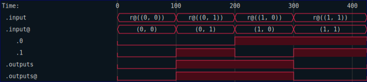
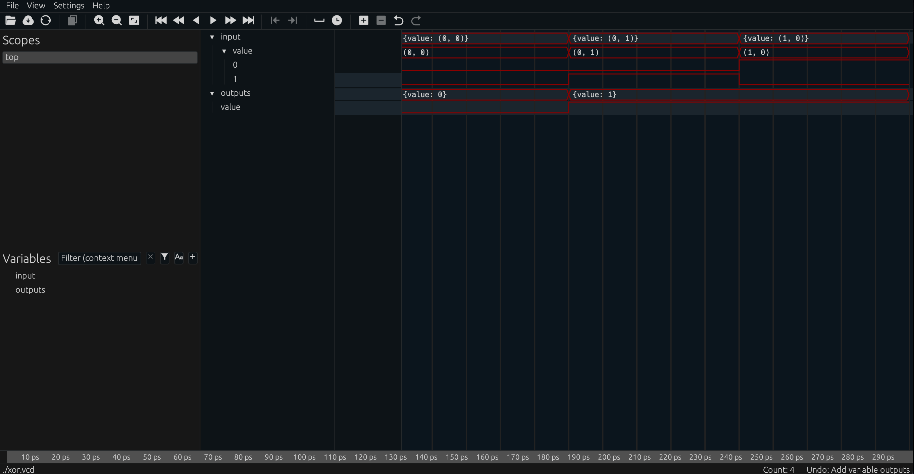
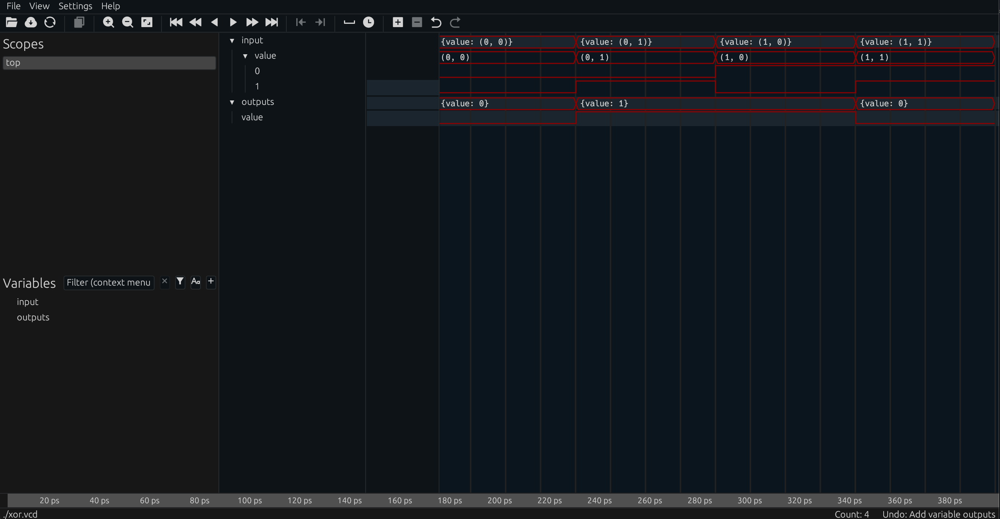

# Chapter 1 - The Foundation

Let's start with the most important part of understanding how RHDL represents
hardware designs.  RHDL uses a hierarchical, encapsulated design strategy in which
circuits are composed of sub-circuits, "glued" together with pure functions.  This
diagram is extremely important to understanding how RHDL works:

```badascii
       +----------------------------------------------------------------+        
       |                                                                |        
 input |                   +-----------------------+                    | output 
+----->+------------------>|input            output+--------------------+------->
       |                   |         Kernel        |                    |        
       |              +--->|q                     d+-----+              |        
       |              |    +-----------------------+     |              |        
       |              |                                  |              |        
       |              |    +-----------------------+     |              |        
       | q.child_1 +> +----+o        child_1      i|<----+ <+ d.child_1 |        
       |              |    +-----------------------+     |              |        
       |              |                                  |              |        
       |              |    +-----------------------+     |              |        
       | q.child_2 +> +----+o        child_2      i|<----+ <+ d.child_2 |        
       |                   +-----------------------+                    |        
       |                                                                |        
       +----------------------------------------------------------------+        
```

A hardware component has a set a set of inputs and a set of outputs.  Inputs
arrive into the component, are processed by the internals of the component
and generate outputs.  

The internals of the component consist of the following pieces:

1.  A pure `kernel` function
2.  Zero or more child components

That's it.  And yet, with this model it is possible to construct components
of arbitrary complexity.  

The `kernel` function has a signature that looks like:

```rust, ignore
fn kernel(inputs: I, child_outputs: Q) -> (O, D)
```

where the types are:

1. `I` is the type that describes the shape of all inputs into the component.
2. `Q` is the type that describes the shape of all outputs of internal components.
3. `D` is the type that describes the shape of all inputs to internal components.
4. `O` is the type that describes the shape of all outputs out of the component.

Before diving into an example, there is a slight peculiarity here.  Components
are structs, and child components are composed into parent components with a simple
`struct` definition.  For the diagram above, we would have something like

```rust, ignore
pub struct MyCircuit {
     child_1: ChildCircuitType1,
     child_2: ChildCircuitType2
}
```

The idiomatic Rust way to form the `Q` and `D` types would be to use tuples, so that
effectively:

```rust, ignore
type Q = (ChildCircuitType1::O, ChildCircuitType2::O)
type D = (ChildCircuitType1::I, ChildCircuitType2::I)
```

and while this works well for trivial examples, it does not scale well to components containing several internal child components.  So we add a bit of additional flexibility and some macro magic to make things cleaner.  More on that in a bit.

## A Simple XOR Gate

Let's put some examples together, and along the way, I will show you the necessary annotations and `derive` steps to get it all working.  We will build a simple XOR gate which takes two inputs, and computes the exclusive OR of the output.  This component has no internal components, just the compute kernel.   RHDL has a lot of types, and importing them piecemeal can be difficult. 


 So we start with a prelude import.  It will make life simpler:

```rust
use rhdl::prelude::*;
```

Next comes our `XorGate`, which has no internals,  so the `struct` that describes it is a unit.

```rust
use rhdl::prelude::*;

pub struct XorGate;
```

We need to provide the definitions of `I, O, D, Q` as described previously.  These are done by the `CircuitIO` and `CircuitDQ` traits.  The `D` and `Q` types are easy.  There is no internal structure so they are both empty.

```rust
use rhdl::prelude::*;

pub struct XorGate;

impl CircuitDQ for XorGate {
     type D = ();
     type Q = ();
}
```

For the input and output types, we need types that `impl Timed`.  There is a subtlety here that involves with how asynchronous signals are handled in RHDL.  We will return to this later.  For now, we need to understand that an XOR gate really needs to manipulate signals that belong to the same time domain (whatever that may be).  In RHDL, time domains are represented by colors, so we pick one (`Red` because its short to type), and indicate that the input of our XOR gate is a pair of 1-bit signals in some time domain, and the output is a single 1-bit signal in the same time domain.  For simplicity, we will use a `(bool, bool)` tuple on the input, and a single `bool` on the output:

```rust
use rhdl::prelude::*;

pub struct XorGate;

impl CircuitDQ for XorGate {
     type D = ();
     type Q = ();
}

impl CircuitIO for XorGate {
     type I = Signal<(bool, bool), Red>;
     type O = Signal<bool, Red>;
     type Kernel = xor_gate;    // 👈 doesn't exist yet
}
```

So far, we have described our gate as looking like this:

```badascii
             +-+XorGate+-+       
(bool,bool)  |           | bool  
+----------->|     ?     +------>
             |           |       
             +-----------+       
```
where the time domain has been suppressed on the diagram as implied.  With these `impl` in place,
we can go back and add the `derive` that implements the `Circuit` trait for us:

```rust
use rhdl::prelude::*;

#[derive(Circuit, Clone)] // 👈 new!
pub struct XorGate;

impl CircuitDQ for XorGate {
     type D = ();
     type Q = ();
}

impl CircuitIO for XorGate {
     type I = Signal<(bool, bool), Red>;
     type O = Signal<bool, Red>;
     type Kernel = xor_gate;
}
```

The last piece is the kernel itself.  The signature for the kernel is described in the `CircuitIO` trait:

```rust,ignore
type Kernel: DigitalFn + DigitalFn2<A0 = Self::I, A1 = Self::Q, O = (Self::O, Self::D)>;
```

which is an ugly way of saying that `Kernel` has the shape of `fn(I, Q) -> (O, D)`.  So let's write it as
such.

```rust
# use rhdl::prelude::*;
 👇 needed!
pub fn xor_gate(i: Signal<(bool, bool), Red>, q: ()) -> (Signal<bool, Red>, ()) {
     todo!()
}
```

The function needs to be `pub` For Reasons.  Ok, so we now have these `Signal` things, and need to compute the XOR function.  You can't do much with a `Signal` type itself, but it's just a wrapper, and you can get at the underlying value with the `.val()` method.  There is also a type-inferred constructor function named `signal` to build a `Signal` out of a value.  So most of the kernel is just unwrapping and rewrapping the values.  

```rust
#use rhdl::prelude::*;
pub fn xor_gate(i: Signal<(bool, bool), Red>, q: ()) -> (Signal<bool, Red>, ()) {
     let (a, b) = i.val(); // a and b are both bool
     let c = a ^ b; // Exclusive OR
     (signal(c), ())
}
```

Finally, we need to turn this ordinary Rust function into something synthesizable in hardware, and for that we need the `#[kernel]` attribute.  

```rust
#[kernel] // 👈 new!
pub fn xor_gate(i: Signal<(bool, bool), Red>, q: ()) -> (Signal<bool, Red>, ()) {
     let (a,b) = i.val(); // a and b are both bool
     let c = a ^ b; // Exclusive OR
     (signal(c), ())
}
```

Great!  That may seem like a lot of boiler plate for a lowly `XOR` gate, but remember that we are intentionally adding verbosity here.  We want to signal our intentions with the type system, and that requires extra words.  It will all be worth it when the complexity grows.

So here is our completed `XorGate`:

```rust
use rhdl::prelude::*;

#[derive(Circuit, Clone)]
struct XorGate;

impl CircuitDQ for XorGate {
    type D = ();
    type Q = ();
}

impl CircuitIO for XorGate {
    type I = Signal<(bool, bool), Red>;
    type O = Signal<bool, Red>;
    type Kernel = xor_gate;
}

#[kernel]
fn xor_gate(i: Signal<(bool, bool), Red>, _q: ()) -> (Signal<bool, Red>, ()) {
    let (a, b) = i.val();
    let c = a ^ b;
    (signal(c), ())
}
```

It would probably be a good idea to test our circuit, right?  So let's turn to testing.

We probably want to test all possible inputs of our `XorGate`, and since there are only four inputs, it shouldn't be too hard.  We can start by testing our kernel itself.  Just as a plain Rust function (which it still is...)

```rust
#[test]
fn test_all_inputs() {
    let inputs = [(false, false), (false, true), (true, false), (true, true)];
    let outputs = [false, true, true, false];
    inputs.iter().zip(outputs.iter()).for_each(|(inp, outp)| {
        let (y, _) = xor_gate(signal(*inp), ());
        assert_eq!(y.val(), *outp);
    });
}
```

Ok - that was easy enough.  But that just tests that our logic was correct, right?  What about testing more of the things?  How do I know the generated hardware will work as intended?  And what does the generated hardware look like, anyway?

We can use `expect_test` to check that the generated hardware matches our expectations.  RHDL uses a simplified `Verilog` dialect to describe hardware designs.  So let's convert our `XorGate` into Verilog and make sure it looks reasonable.

```rust
#[test]
fn test_verilog_output() {
    let expect = expect_test::expect![[r#"
        module xor_gate(input wire [1:0] i, output wire [0:0] o);
           wire [0:0] od;
           assign o = od[0:0];
           assign od = kernel_xor_gate(i);
           function [0:0] kernel_xor_gate(input reg [1:0] arg_0);
                 reg [1:0] or0;
                 reg [0:0] or1;
                 reg [0:0] or2;
                 reg [0:0] or3;
                 begin
                    or0 = arg_0;
                    or1 = or0[0:0];
                    or2 = or0[1:1];
                    or3 = or1 ^ or2;
                    kernel_xor_gate = or3;
                 end
           endfunction
        endmodule
    "#]];
    let gate = XorGate;
    let hdl = gate.hdl("xor_gate")?;
    expect.assert_eq(&hdl.as_module().to_string());
    Ok(())
}
```

While not exactly "compact", it is definitely understandable as a translation of the original Rust code.  

We can now test the Rust function, and generate Verilog.  But we can also simulate our `XorGate` from the comfort of our RHDL environment.  To do so, we need to generate a test input sequence, and then pass it through a simulation of the gate to generate an output sequence.  To simulate the response of a RHDL circuit to a given input, we can use the derived `sim` method, which is quite easy to use:

```rust
#[test]
fn test_simulation() -> miette::Result<()> {
    let gate = XorGate;
    let inputs = [(false, false), (false, true), (true, false), (true, true)];
    let outputs = [false, true, true, false];
    let mut state = gate.init(); // 👈 Initialize state (empty in this case)
    for (inp, outp) in inputs.iter().zip(outputs.iter()) {
        //                Sim method           Internal state
        //                 👇                     👇
        let output = gate.sim(signal(*inp), &mut state);
        //                       👆 test input
        assert_eq!(output.val(), *outp);
    }
    Ok(())
}
```

It's that simple.  Internally RHDL includes a simulator that will propagate signal changes, and apply kernels and functions as needed.  There are some ergonomic improvements when working with clocked (synchronous) circuits, but we will look at those later.

Finally, we can generate a trace of our simple gate to show it in operation. 

```rust
#[test]
fn test_vcd() {
    let gate = XorGate;
    let inputs = [(false, false), (false, true), (true, false), (true, true)];
    let mut state = gate.init();
    let guard = trace_init_db();
    for (time, inp) in inputs.iter().enumerate() {
        //           👇 advance time by 100 units
        trace_time((time * 100) as u64);
        let _output = gate.sim(signal(*inp), &mut state);
    }
    //                                   👇 Output waves for up to 500 time units
    let svg = guard.take().dump_svg(0..=500, &Default::default());
    std::fs::write("xor.svg", svg.to_string()).unwrap();
}
```

The resulting trace file (as generated by RHDL) is shown below:



Note that you can also generate a traditional VCD file, which you can then open with a tool like [surfer](https://surfer-project.org/).  For the sake of completeness, let's update the test to output a VCD file instead.

```rust
#[test]
fn test_vcd_without_svg() {
    let gate = XorGate;
    let inputs = [(false, false), (false, true), (true, false), (true, true)];
    let mut state = gate.init();
    let guard = trace_init_db();
    for (time, inp) in inputs.iter().enumerate() {
        trace_time((time * 100) as u64);
        let _output = gate.sim(signal(*inp), &mut state);
    }
    let vcd = std::fs::File::create("xor.vcd").unwrap(); // 👈 New
    guard.take().dump_vcd(vcd, None).unwrap(); // 👈 uses `dump_vcd`
}
```

Here is a screen shot of the VCD as rendered by surfer:



If you look carefully, you will notice that it appears that our last test case is missing.  This is an artifact of how RHDL generates VCD.  Since the last input was at time 400, the VCD will end at that time.  We definitely want the VCD to go a bit farther to show the output at that time, but need a way to push that last output cycle into the VCD.  The simplest way is to simply add an extra input stimulus, so we get the output as intended.

```rust
#[test]
fn test_vcd_without_svg() {
    let gate = XorGate;
    //                                                             extra input      👇 
    let inputs = [(false, false), (false, true), (true, false), (true, true), (false, false)];
    let mut state = gate.init();
    let guard = trace_init_db();
    for (time, inp) in inputs.iter().enumerate() {
        trace_time((time * 100) as u64);
        let _output = gate.sim(signal(*inp), &mut state);
    }
    let vcd = std::fs::File::create("xor.vcd").unwrap();
    guard.take().dump_vcd(vcd, None).unwrap();
}
```

The updated screen shot now shows the last output cycle, as the simulation terminates at time 400 now.  Keep this in mind when running simulations in RHDL.  If the last cycle of the simulation matters, make sure you allow for an extra input to make it visible.



## An ALU with Enums

Let's try and build something a bit more interesting, and in the process, learn more about the fundamental types in RHDL.  Our goal will be to build a simple ALU.  Nothing overly complicated.  It will support the following operations:

- Add two numbers (unsigned, with wrapping)
- Bitwise AND two numbers
- Bitwise OR two number
- Bitwise XOR two numbers

We will assume (to avoid the need to add generics at this point) that all of the numbers are 4-bits wide.  RHDL has support for signed and unsigned bit vectors of up to 128 bits in length.  These are included in the prelude, and are referenced as `b1..b128` for unsigned bit vectors, and `s1..s128` for signed bit vectors.  These are both types and functions.  But we will cover more of that in a moment.

Our ALU will also use an enum to capture the operation.  A simple list of operations seems reasonable:

```rust
use rhdl::prelude::*;

pub enum OpCode {
     Add,
     And,
     Or,
     Xor
}
```

We need a struct to define the ALU, but again, there are no internal components, so it's a unit struct.  Like the `XorGate`, it has no `D` or `Q` types, and we can write `impl` blocks for the `CircuitDQ` and `CircuitIO` traits already, with a placeholder for the kernel itself:

```rust
use rhdl::prelude::*;

pub enum OpCode {
     Add,
     And,
     Or,
     Xor     
}

pub struct Alu;

impl CircuitDQ for Alu {
     type D = ();
     type Q = ();
}

impl CircuitIO for Alu {
     type I = Signal<(OpCode, b4, b4), Green>;
     type O = Signal<b4, Green>;
     type Kernel = alu;  // 👈 doesn't exist yet
}
```

Attempting to compile this will yield a lot of compiler messages.  But the critical one is that `OpCode` does not `impl Digital`.  The `Digital` trait is used by RHDL to represent any type that can be represented as zero or more bits (with a constant number of bits).  All of the bit vectors from RHDL already `impl Digital`, as do tuples and arrays of `Digital` types.  In our case, we could implement the trait by hand, or we could `derive` it.  While implementing the trait by hand is a fun exercise, it's also fairly tedious.  We can derive it instead:

```rust
use rhdl::prelude::*;

//   New!  👇          👇  Required!
#[derive(Digital, PartialEq)]
pub enum OpCode {
     Add,
     And,
     Or,
     Xor     
}

pub struct Alu;

impl CircuitDQ for Alu {
     type D = ();
     type Q = ();
}

impl CircuitIO for Alu {
     type I = Signal<(OpCode, b4, b4), Green>;
     type O = Signal<b4, Green>;
     type Kernel = alu; 
}
```

We _still_ get an error, this time indicating that `OpCode` must `impl Default`.  The need for a default value for enums is a safety net issue.  Because we do not want to ever have a situation in which a representation of an enum is not valid, there are corner cases where RHDL needs to construct an enum value to make available.  The safest option is to require a default value.  In most cases, there is probably a default value or fallback.  If there isn't then consider wrapping the type in an `Option`.  For us, we will assume that `Add` is the default operation.

```rust
use rhdl::prelude::*;

//                        New!  👇
#[derive(Digital, PartialEq, Default)]
pub enum OpCode {
     #[default] // 👈 Required
     Add,       //    Inidcates Add is the default op
     And,
     Or,
     Xor     
}

pub struct Alu;

impl CircuitDQ for Alu {
     type D = ();
     type Q = ();
}

impl CircuitIO for Alu {
     type I = Signal<(OpCode, b4, b4), Green>;
     type O = Signal<b4, Green>;
     type Kernel = alu; 
}
```

Next, we need to add `Circuit` and `Clone` to our `Alu`.  The `Circuit` trait requires `Clone` (but not `Copy`), while `Digital` requires (and provides) `Clone` and `Copy`.  The idea is that data should be cheaply copyable, but circuits should be cloneable.  This is a reasonable approximation to real life hardware.  

```rust
use rhdl::prelude::*;

#[derive(Digital, PartialEq, Default)]
pub enum OpCode {
     #[default] // 👈 Required
     Add,       //    Inidcates Add is the default op
     And,
     Or,
     Xor     
}

//      New!  👇
#[derive(Clone, Circuit)]
pub struct Alu;

impl CircuitDQ for Alu {
     type D = ();
     type Q = ();
}

impl CircuitIO for Alu {
     type I = Signal<(OpCode, b4, b4), Green>;
     type O = Signal<b4, Green>;
     type Kernel = alu; 
}
```

We are now left to write the `alu` kernel function.  I start with a simple Rust function that has the right type signature:

```rust
#use rhdl::prelude::*;
fn alu(i: Signal<(OpCode, b4, b4), Green>, _q: ()) -> (Signal<b4, Green>, ()) {
     todo!()
}
```

The underlying `Bits` type (of which `b4` is simply an alias) already has implementations for our ALU operations, so the actual internals of the kernel are pretty simple.  A single match will do:

```rust
# use rhdl::prelude::*;
# #[derive(Digital, PartialEq, Default)]
# pub enum OpCode {
#     #[default] // 👈 Required
#     Add,       //    Inidcates Add is the default op
#     And,
#     Or,
#     Xor     
# }
pub fn alu(i: Signal<(OpCode, b4, b4), Green>, _q: ()) -> (Signal<b4, Green>, ()) {
    let (opcode, a, b) = i.val();
    let c = match opcode {
        OpCode::Add => a + b,
        OpCode::And => a & b,
        OpCode::Or => a | b,
        OpCode::Xor => a ^ b,
    };
    (signal(c), ())
}
```

Finally, we add the `#[kernel]` attribute to the function to indicate that it is a synthesizable function.  It's a good idea to add the attribute at the end, as Rust Analyzer (or whatever LSP you use) will have an easier time helping you with the code when the macros are not in the way.

```rust
# use rhdl::prelude::*;
# #[derive(Digital, PartialEq, Default)]
# pub enum OpCode {
#     #[default]
#     Add,      
#     And,
#     Or,
#     Xor     
# }

#[kernel] // 👈 New
pub fn alu(i: Signal<(OpCode, b4, b4), Green>, _q: ()) -> (Signal<b4, Green>, ()) {
    let (opcode, a, b) = i.val();
    let c = match opcode {
        OpCode::Add => a + b,
        OpCode::And => a & b,
        OpCode::Or => a | b,
        OpCode::Xor => a ^ b,
    };
    (signal(c), ())
}
```

