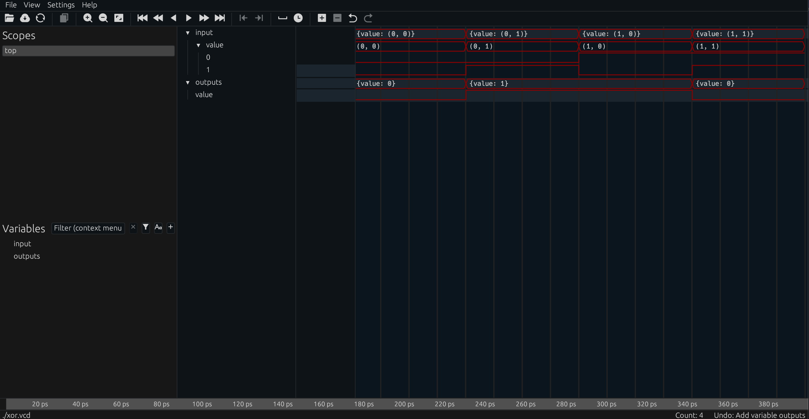

# Chapter 2 - A Simple Xor Gate

We will walk through the process of building and testing a simple Xor gate.  This is the simplest possible asynchronous circuit, and contains no internal sub-components.  But in the process, we can learn much about RHDL, including how to test and synthesize the resulting circuits.

## Setting Up

```shell,rhdl-silent
# Remove the foo directory to get a clean slate
rm -rf xor
```

Let's start by creating a new Rust project.  We want a library, since the `xor` gate is something that will go into other designs.  If we were making a final top level design, a binary might be more appropriate.  We need the `rhdl` dependency.  `RHDL` uses `miette` to provide error reporting, so we will add that as well.

```shell,rhdl
cargo new --lib xor
cd xor
cargo add --path ~samitbasu/Devel/rhdl/crates/rhdl rhdl
cargo add --dev miette
```

In the `src` directory, we will start by importing the prelude for `RHDL`, which brings a lot of useful signals into scope. 

```rust,write:xor/src/lib.rs
use rhdl::prelude::*;
```

So far, so good.

```shell,rhdl:xor
cargo check -q
```

## The Gate

Next comes our `XorGate`, which has no internals,  so the `struct` that describes it is a unit.

```rust,write:xor/src/lib.rs
use rhdl::prelude::*;

pub struct XorGate;
```

We need to provide the definitions of `I, O, D, Q` as described previously.  These are done by the `CircuitIO` and `CircuitDQ` traits.  The `D` and `Q` types are easy.  There is no internal structure so they are both empty.

```rust
use rhdl::prelude::*;

pub struct XorGate;

impl CircuitDQ for XorGate {
     type D = ();
     type Q = ();
}
```

For the input and output types, we need types that `impl Timed`.  There is a subtlety here that involves with how asynchronous signals are handled in RHDL.  We will return to this later.  For now, we need to understand that an XOR gate really needs to manipulate signals that belong to the same time domain (whatever that may be).  In RHDL, time domains are represented by colors, so we pick one (`Red` because its short to type), and indicate that the input of our XOR gate is a pair of 1-bit signals in some time domain, and the output is a single 1-bit signal in the same time domain.  For simplicity, we will use a `(bool, bool)` tuple on the input, and a single `bool` on the output:

```rust
use rhdl::prelude::*;

pub struct XorGate;

impl CircuitDQ for XorGate {
     type D = ();
     type Q = ();
}

impl CircuitIO for XorGate {
     type I = Signal<(bool, bool), Red>;
     type O = Signal<bool, Red>;
     type Kernel = xor_gate;    // 👈 doesn't exist yet
}
```


So far, we have described our gate as looking like this:

```badascii
             +-+XorGate+-+       
(bool,bool)  |           | bool  
+----------->|     ?     +------>
             |           |       
             +-----------+       
```
where the time domain has been suppressed on the diagram as implied.  With these `impl` in place,
we can go back and add the `derive` that implements the `Circuit` trait for us:

```rust
use rhdl::prelude::*;

#[derive(Circuit, Clone)] // 👈 new!
pub struct XorGate;

impl CircuitDQ for XorGate {
     type D = ();
     type Q = ();
}

impl CircuitIO for XorGate {
     type I = Signal<(bool, bool), Red>;
     type O = Signal<bool, Red>;
     type Kernel = xor_gate;
}
```

The last piece is the kernel itself.  The signature for the kernel is described in the `CircuitIO` trait:

```rust,ignore
type Kernel: DigitalFn + DigitalFn2<A0 = Self::I, A1 = Self::Q, O = (Self::O, Self::D)>;
```

which is an ugly way of saying that `Kernel` has the shape of `fn(I, Q) -> (O, D)`.  So let's write it as
such.

```rust
# use rhdl::prelude::*;
 👇 needed!
pub fn xor_gate(i: Signal<(bool, bool), Red>, q: ()) -> (Signal<bool, Red>, ()) {
     todo!()
}
```

The function needs to be `pub` For Reasons™.  Ok, so we now have these `Signal` things, and need to compute the XOR function.  You can't do much with a `Signal` type itself, but it's just a wrapper, and you can get at the underlying value with the `.val()` method.  There is also a type-inferred constructor function named `signal` to build a `Signal` out of a value.  So most of the kernel is just unwrapping and rewrapping the values.  

```rust
#use rhdl::prelude::*;
pub fn xor_gate(i: Signal<(bool, bool), Red>, q: ()) -> (Signal<bool, Red>, ()) {
     let (a, b) = i.val(); // a and b are both bool
     let c = a ^ b; // Exclusive OR
     (signal(c), ())
}
```

Finally, we need to turn this ordinary Rust function into something synthesizable in hardware, and for that we need the `#[kernel]` attribute.  

```rust
#[kernel] // 👈 new!
pub fn xor_gate(i: Signal<(bool, bool), Red>, q: ()) -> (Signal<bool, Red>, ()) {
     let (a,b) = i.val(); // a and b are both bool
     let c = a ^ b; // Exclusive OR
     (signal(c), ())
}
```

Great!  That may seem like a lot of boiler plate for a lowly `XOR` gate, but remember that we are intentionally adding verbosity here.  We want to signal our intentions with the type system, and that requires extra words.  It will all be worth it when the complexity grows.

So here is our completed `XorGate`:

```rust,write:xor/src/lib.rs
use rhdl::prelude::*;

#[derive(Circuit, Clone)]
pub struct XorGate;

impl CircuitDQ for XorGate {
    type D = ();
    type Q = ();
}

impl CircuitIO for XorGate {
    type I = Signal<(bool, bool), Red>;
    type O = Signal<bool, Red>;
    type Kernel = xor_gate;
}

#[kernel]
pub fn xor_gate(i: Signal<(bool, bool), Red>, _q: ()) -> (Signal<bool, Red>, ()) {
    let (a, b) = i.val();
    let c = a ^ b;
    (signal(c), ())
}
```

```shell,rhdl-silent:xor
cargo check -q
```

```shell,rhdl:xor
cargo check
```

It would probably be a good idea to test our circuit, right?  So let's turn to testing.

## Basic Testing

We probably want to test all possible inputs of our `XorGate`, and since there are only four inputs, it shouldn't be too hard.  We can start by testing our kernel itself.  Just as a plain Rust function (which it still is...)

```shell,rhdl:xor
mkdir tests
```

```rust,write:xor/tests/test_inputs.rs
use rhdl::prelude::*;
use xor::*;

#[test]
fn test_all_inputs() {
    let inputs = [(false, false), (false, true), (true, false), (true, true)];
    let outputs = [false, true, true, false];
    inputs.iter().zip(outputs.iter()).for_each(|(inp, outp)| {
        let (y, _) = xor_gate(signal(*inp), ());
        assert_eq!(y.val(), *outp);
    });
}
```

```shell,rhdl:xor
cargo build -q
cargo test 
```

Ok - that was easy enough.  But that just tests that our logic was correct, right?  What about testing more of the things?  How do I know the generated hardware will work as intended?  And what does the generated hardware look like, anyway?  The simpleset way to get a view on the generated HDL is to use the `.hdl` method on any struct that `impl Circuit`.  The result can be converted into a module and then a string.   The following test does exactly that.

```rust,write:xor/tests/show_verilog.rs
use rhdl::prelude::*;

#[test]
fn show_verilog() -> miette::Result<()> {
     let gate = xor::XorGate;
     let hdl = gate.hdl("xor_gate")?.as_module();
     eprintln!("{hdl}");
     Ok(())
}
```

```shell,rhdl:xor
cargo build -q
cargo test --test show_verilog -- --nocapture
```

While not required, it is often handy to check that the output of an HDL generation step has not changed from the last time you reviewed or tested it.  As such, a crate like [expect-test](https://github.com/rust-analyzer/expect-test) can be used to check that the output is still correct.  We can add it as a `dev` dependency to our project

```shell,rhdl:xor
cargo add --dev expect-test
```

A test using `expect-test` can write the expected Verilog code to a file and, then verify it later.

```rust,write:xor/tests/expect_verilog.rs
use rhdl::prelude::*;

#[test]
fn test_verilog_output() -> miette::Result<()> {
     let gate = xor::XorGate;
     let hdl = gate.hdl("xor_gate")?.as_module();
     let expect = expect_test::expect_file!["xor.v.expect"];
     expect.assert_eq(&hdl.to_string());
     Ok(())
}
```

You can run the test with an `UPDATE_EXPECT=1` to get the expected output to be written to a file.
```shell,rhdl:xor
cargo build -q
UPDATE_EXPECT=1 cargo test --test expect_verilog
cat tests/xor.v.expect
```

Then in the future, you can run the test, and it will compare the generated code against the template file stored.

```shell,rhdl:xor
cargo test --test expect_verilog
```

## Iterator Based Testing

RHDL heavily favors the use of iterators for testing designs.  Many (but not all) circuits can be tested as black boxes in the following fashion:

```badascii
              +---------+
 Inputs +---->| Circuit |+----> Outputs
              +---------+
```

This is a form of "open loop testing".  We present the circuit with a series of input items, and for each input item we see that the output matches our expectations.  It becomes more complicated when we need to close the loop between the outputs and the inputs.  But for many cases, we can use a simple open loop design.

Iterators are perfect for these use cases.  Iterators allow us to take any sequence of input values, and simulate the circuit behavior for that input value.  We then get a series of output values in the form of a new iterator, which can be used to test the output of the function.

In the case of our simple Xor gate, we can create an iterator that cycles through the list of possible inputs, and then use the `run` method of every `Circuit` to map that iterator into an iterator of output values.  We can do something simple like just print them to the console:


```rust,write:xor/tests/test_iterator.rs
use rhdl::prelude::*;

#[test]
fn test_iterators() -> miette::Result<()> {
    let inputs = [(false, false), (false, true), (true, false), (true, true)];
    //                       Separate samples by 100 units - 👇
    let it = inputs.into_iter().cycle().take(5).map(signal).uniform(100);
    let uut = xor::XorGate;
    for y in uut.run(it) {
        eprintln!("{}", y);
    }
    Ok(())
}
```

Here we show a chain of iterators.  Let's break it down:

- `inputs.into_iter()` is an iterator that yields `(bool, bool)`
- `.cycle()` converts it into a repeating loop - this is handy to get the extra element at the end of the test cycle
- `.take(5)` takes exactly 5 elements from the iterator
- `.map(signal)` applies the `signal` function to each, so that we get `Signal<(bool, bool), Red>` (where the domain `Red` is inferred from the type signature of the XorGate)
- `.uniform(100)` this advances time by 100 units with each sample.  The simulation engine operates on samples with a known time, so you need to feed it a series of `TimedSample` structs with monotonically increasing timestamps.  The `Uniform` iterator extension trait provides this functionality.

```shell,rhdl:xor
cargo build -q
cargo test --test test_iterator -- --nocapture
```  

RHDL then provides every `Circuit` with a method that consumes an iterator of `TimedSample<CircuitIO::I>` via the `RunExt` trait.  As you can see from the output of the test function, the output iterator of `.run(it)` yields items of type `TimedSample<(CircuitIO::I, CircuitIO::O)>`.  Let's upgrade our iterator test to check that the output meets our definition of an XorGate.  

```rust,write:xor/tests/test_iterator_expected.rs
use rhdl::prelude::*;

#[test]
fn test_iterators() -> miette::Result<()> {
    let inputs = [(false, false), (false, true), (true, false), (true, true)];
    let it = inputs.into_iter().cycle().take(5).map(signal).uniform(100);
    let uut = xor::XorGate;
    //                   👇 TimedSample<(Signal<(bool,bool), Red>, Signal<bool, Red>)>
    uut.run(it).for_each(|s| {
        let input = s.value.0.val();
        let output = s.value.1.val();
        let expected = input.0 ^ input.1;
        assert_eq!(output, expected, "For input {input:?}, expected {expected}");
    });
    Ok(())
}
```

To break down the `for_each` argument, we have a `TimedSample<(I,O)>`.  To get the input, we compute

- `s.value` extracts the value from the `TimedSample`
- `s.value.0` extracts the Input from the tuple
- `s.value.0.val()` extracts the `(bool, bool)` value from the `Signal<(bool, bool), Red>`
- `s.value.1.val()` extracts the `bool` value from the output `Signal<bool, Red>`

```shell,rhdl:xor
cargo build -q
cargo test --test test_iterator_expected
```

Tests like these are extremely helpful to verify that your circuitry is working as expected, and much easier than writing Verilog testbenches or studying traces.  There are occaisons when you may need to do that, so let's continue.

## Making Trace Files

There are other things you can do with an output iterator from the `.run` method.  One neat thing you can do in RHDL is to generate a VCD file or even a SVG of a trace display.  The `Vcd` container can collect the output of the simulation, and then be written to either type of file.  Using the `Vcd` container is extremely simple, you just `.collect` the iterator into it.  Consult the documentation to see what options the `svg` export supports.  You can filter traces, and adjust the sizes of various elements in the rendered image.

Here is the updated test

```rust,write:xor/tests/test_svg.rs
use rhdl::prelude::*;

#[test]
fn test_svg() -> miette::Result<()> {
    let inputs = [(false, false), (false, true), (true, false), (true, true)];
    let it = inputs.into_iter().cycle().take(5).map(signal).uniform(100);
    let uut = xor::XorGate;
    let vcd: Vcd = uut.run(it).collect();
    let svg = vcd.dump_svg(&SvgOptions::default());
    std::fs::write("xor.svg", svg.to_string()).unwrap();
    Ok(())
}
```

```shell,rhdl:xor
cargo build -q
cargo test --test test_svg
```

The resulting SVG shows the input and output signals as one would expect for a trace file.

```shell,rhdl-silent:xor
cp xor.svg $ROOT_DIR/src/img/.
```


You can also generate a traditional `VCD` file which can be opened by other tools like [surfer](https://surfer-project.org/).  Here is a test file to generate a `.vcd` file.

```rust,write:xor/tests/test_vcd.rs
use rhdl::prelude::*;

#[test]
fn test_vcd() -> miette::Result<()> {
    let inputs = [(false, false), (false, true), (true, false), (true, true)];
    let it = inputs.into_iter().cycle().take(5).map(signal).uniform(100);
    let uut = xor::XorGate;
    let vcd: Vcd = uut.run(it).collect();
    let file = std::fs::File::create("xor.vcd").unwrap();
    vcd.dump(file).unwrap();
    Ok(())
}
```

```shell,rhdl:xor
cargo build -q
cargo test --test test_vcd
```

Here is a screen shot of the VCD as rendered by `surfer`:



## Verilog Testbenches

The last way to test your circuit is to generate a Verilog testbench and run the entire thing through a standalone simulation tool.  This can also be done using the iterator produced by the `.run` method.  But instead of collecting into a `Vcd`, we will collected into a `TestBench` object.  Once we have a `TestBench`, we can generate a test module at either the RTL (Register Transfer Language) level or the NTL (Netlist) level.  Which one you want to use depends on the nature of your test.  The RTL description is closer to the top level Rust code, and easier to map from the source code to the corresponding Verilog entity.  But the NTL description is also useful for more low level testing.  

Let's start with the simplest version, we collect the output into a testbench, and then write it to Verilog with a RTL description of the circuit:

```rust,write:xor/tests/test_tb_1.rs
use rhdl::prelude::*;

#[test]
fn test_testbench() -> miette::Result<()> {
    let inputs = [(false, false), (false, true), (true, false), (true, true)];
    let it = inputs.into_iter().cycle().take(5).map(signal).uniform(100);
    let uut = xor::XorGate;
    let tb: TestBench<_, _> = uut.run(it).collect();
    let tb = tb.rtl(&uut, &TestBenchOptions::default())?;
    std::fs::write("xor_tb.v", tb.to_string()).unwrap();
    Ok(())
}
```

We can generate the testbench file by running the test:

```shell,rhdl:xor
cargo build -q
cargo test --test test_tb_1
cat xor_tb.v
```

The simplest thing we can do at this point is run the testbench.  Assuming you have a tool like `icarus` installed, you can execute the testbench as:

```shell,rhdl:xor
icarus xor_tb.v
./a.out
```

if we wanted a lower level (netlist) representation, we can use the `.ntl` method on the `TestBench`.  Generally, netlist manipulation is not a core element of RHDL - it is used as an analysis tool to check for various design issues.  But you can still check that the output simulates correctly:

```rust,write:xor/tests/test_tb_2.rs
use rhdl::prelude::*;

#[test]
fn test_testbench_ntl() -> miette::Result<()> {
    let inputs = [(false, false), (false, true), (true, false), (true, true)];
    let it = inputs.into_iter().cycle().take(5).map(signal).uniform(100);
    let uut = xor::XorGate;
    let tb: TestBench<_, _> = uut.run(it).collect();
    let tb = tb.ntl(&uut, &TestBenchOptions::default())?;
    std::fs::write("xor_tb_ntl.v", tb.to_string()).unwrap();
    Ok(())
}
```
We can generate the testbench file again, and run it through `icarus`:

```shell,rhdl:xor
cargo build -q
cargo test --test test_tb_2
cat xor_tb_ntl.v
```

```shell,rhdl:xor
icarus xor_tb_ntl.v
./a.out
```

## Fixtures, Synthesis and Hardware

As a last step, we will put our simple `XorGate` onto a physical device!  This means we need to export the design in such a way that conventional tools can understand our design, and so that we can connect it up to physical endpoints.  Typically, this involves the following steps:

- We need to `Fixture` our device.  The name implies that we want to plug our design into a larger object that provides the needed inputs and outputs to interface to the physical system.
- We need `Driver`s to connect those physical inputs and outputs to our RHDL design. 
- We need to export the whole thing to Verilog so that external toolchains can manipulate and synthesize our design
- We can then program a device and test it.

Unfortunately, there is no simple way to do all of this with real hardware without making a bunch of assumptions.  So I will assume that you have some FPGA board and access to enough documentation to do something with it.  For this section, I will use an [Alchitry Cu](https://shop.alchitry.com/collections/products).  It is a relatively inexpensive board, is completely documented, and can be programmed using open source tools.

### Setup

I will assume you have an `Alchitry Cu` FPGA board and the `Alchitry Io` interface board.  But you could easily adapt this to other boards.  I just need something concrete to illustrate the process.  You will also need the `icestorm` toolchain.  For Mac OS X, you can install this with:

```shell
 ❯ brew tap samitbasu/oss-fpga
 ❯ brew install --HEAD icestorm yosys nextpnr-ice40
```

For other platforms, follow the various build steps or use your built-in package manager.

### Fixture

The idea of a `Fixture` is meant to convey the notion of an external support that holds your circuit and provides the inputs and outputs that it needs to communicate with the outside world.  That outside world might be another set of Verilog modules, a physical device, or some other environment.  Ultimately, there are code and config pieces that need to be provided for the circuit you designed to get inputs from the physical world and provide outputs to feed them back.

The concept looks something like this:
```badascii
+-------+Fixture+--------------------------------+
|  pin +------+                    +------+pin   |
|  +-->|Driver+-+               +->|Driver+--->  |
|I     +------+ |               |  +------+     O|
|N              |               |               U|
|P pin +------+ | I +-------+ O |  +------+pin  T|
|U +-->|Driver+-+-->|Circuit+---+->|Driver+---> P|
|T     +------+ |   +-------+   |  +------+     U|
|S              |               |               T|
|  pin +------+ |               |  +------+pin  S|
|  +-->|Driver+-+               +->|Driver+--->  |
|      +------+                    +------+      |
+------------------------------------------------+
```

A `Driver` is a piece of code and configuration that feeds signals from a physical port or pin to the circuit.  It may also provide a path for the circuit output to a physical port or pin.  Drivers can be more complicated and provide both input and output capabilities.  For now, we will just need basic drivers.  Basic input/output drivers can be created with the `bind!` macro.  For our `XorGate`, we will create something that looks like this:

```badascii
    +-+Fixture+-------+      
    |                 |      
a +-+---+    +-----+  |      
    |   |    | XoR |  |      
    |   +--->| Gate+--+-> y
b +-+---+    |     |  |      
    |        +-----+  |      
    +-----------------+      
```

We will then use a constraints file to bind `a, b, y` to pins on the FPGA.  Using the `bind!` macro this is pretty simple:

```rust,write:xor/tests/test_fixture.rs
use rhdl::prelude::*;

#[test]
fn test_make_fixture() -> miette::Result<()> {
    let mut fixture = Fixture::new("xor_top", xor::XorGate);
    bind!(fixture, a -> input.val().0);
    bind!(fixture, b -> input.val().1);
    bind!(fixture, y -> output.val());
    let vlog = fixture.module()?;
    eprintln!("{vlog}");
    std::fs::write("xor_top.v", vlog.to_string()).unwrap();
    Ok(())
}
```

```shell,rhdl:xor
cargo build -q
cargo test --test test_fixture --  --no-capture
```

### Synthesis

So far, we have remained in relatively device-agnostic territory.  But now we need to adopt some tooling to get something we can put on the FPGA of interest.  For the `Io` board, we want to use the first two dip switches of the leftmost switch bank to provide the `a` and `b` inputs to our XorGate.  Based on the [schematic](https://cdn.sparkfun.com/assets/0/2/9/8/a/alchitry_io_v2.pdf) this appears to be the pins `dip1` and `dip2`.  The output LED we want to drive is labelled `l1`.  These names are not sufficient to get to pins on the FPGA.  We need to keep tracing them.  Now we now that:

- Pin `dip1` is connected to connector pin `BB40`
- Pin `dip2` is connected to connector pin `BB39`
- Pin `l1` is connected to connector pin `BB21`

Next, we need the schematic for the Cu board.  From that [schematic](https://cdn.sparkfun.com/assets/d/5/d/b/a/alchitry_cu_sch_update-2.pdf), we can see that

- Connector `BB40` is labelled `IOT_174/1.2A`
- Connector `BB39` is labelled `IOT_172/1.2A`
- Connector `BB21` is labelled `IOR_141_GBIN2/1.4B`

Some more chasing indicates that

- `IOT_174` is connected to ball `C11`
- `IOT_172` is connected to ball `C12`
- `IOR_141_GBIN2` is connected to ball `G14`

Finally!  We have enough to write the PCF file.

```rust,write:xor/xor.pcf
set_io -pullup no a C11
set_io -pullup no b C12
set_io y G14
```

Note that the PCF file is case sensitive.  Next, we run the synthesis using `yosys`, and the place and route using `nextpnr-ice40`.  To simplify, I will use the `just` tool to pack these into a simple task:

```rust,write:xor/Justfile
build:
    yosys -p 'synth_ice40 -top xor_top -json xor_top.json' xor_top.v
    nextpnr-ice40 --hx8k --json xor_top.json --pcf xor.pcf --asc xor.asc --package cb132
    icepack xor.asc xor.bin
    iceprog xor.bin
```
