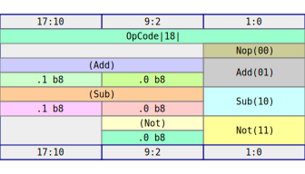
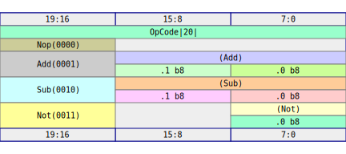
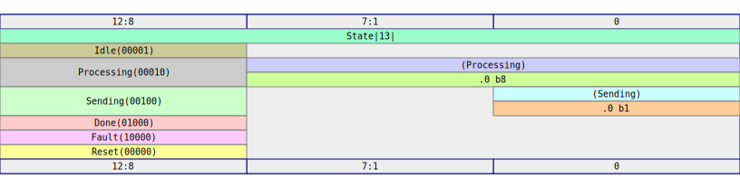
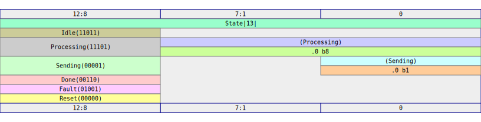

# Advanced

There are times when you want more control over the variants of an `enum`.  In some instances, you may need to pass them from external designs, and they variants may be encoded in some way.  In other instances, you want to specifically control the representation of the `enum` to facilitate the implementation of some circuit.  In these cases, you can use some additional attributes to control the precise layout and values for your enum.  

## LSB Alignment of the Discriminant

Recall, that we laid out our plan for `OpCode` so that the "most significant bits" contained the discriminant.  This layout fits with the idea that "most significant" is equivalent to "most meaningful", and that because the discriminant determines the interpretation of all the lower order bits, that the discriminant should appear at the MSB position within the bitvector representation:

```badascii
+-+tag+--+-+Arg2++-+Arg1+-+
| 17:16  | 15:8  |  7:0   |
+--------+-------+--------+
| Nop 00 |       |        |
| Add 01 |  .1   |   .0   |
| Sub 10 |  .1   |   .0   |
| Not 11 |       |   .0   |
+--------+-------+--------+
```

Suppose, however, that we want the discriminant to appear at the LSBs.  So we want this layout instead:

```badascii
+-+Arg2++-+Arg1+-+-+tag+-+
| 17:10 |  9:2   |   1:0 |
+-------+--------+-------+
|       |        | Nop 00|
|  .1   |   .0   | Add 01|
|  .1   |   .0   | Sub 10|
|       |   .0   | Not 11|
+-------+--------+-------+
```

To achieve this layout, we can add an attribute to our `derive` that specifies an `lsb` alignment:

```rust,write:digital/src/opcode.rs
use rhdl::prelude::*;

#[derive(Copy, PartialEq, Clone, Digital, Default)]
#[rhdl(discriminant_align = "lsb")] // 👈 - New!
pub enum OpCode {
    #[default] 
    Nop,
    Add(b8, b8),
    Sub(b8, b8),
    Not(b8),
}
```

With this change, the tag bits are packed in the LSB of the op code.  We can see that by regenerating our SVG:

```shell,rhdl:digital
cargo build -q
cargo nextest run
```

```shell,rhdl-silent:digital
cp opcode.svg $ROOT_DIR/src/img/opcode_3.svg
```



We can also generate an example value of the `OpCode` and see the serialized value directly.  Let's do that to see the layout explicitly:

```rust,write:digital/tests/print_repr.rs
use rhdl::prelude::*;
use digital::*;

#[test]
fn test_print_repr() {
    let op = opcode::OpCode::Not(0xA5.into());
    println!("{}", bitx_string(&op.bin()));
}
```

If we run this test, we can see that the `11` discriminant bits are rightmost (least significant position)

```shell,rhdl:digital
cargo nextest run test_print_repr --no-capture
```

## Explicit Discriminant Width

Normally RHDL will use the smallest discriminant width necessary to capture all of the discriminant values.  For example, it determined that 2 bits were sufficient to represent `OpCode`'s 4 variants.  But there are cases where we want more control over the width of the discriminant tag.  For example, we may know that future versions of `OpCode` will require an additional number of bits.  Or we may know that `OpCode` will be stored in a memory as a 20 bit value, and thus, want the discriminant to take up the additional bits.  In that case, we can specify that we want the discriminant to be 4 bits wide, using a different attribute:

```rust,write:digital/src/opcode.rs
use rhdl::prelude::*;

#[derive(Copy, PartialEq, Clone, Digital, Default)]
#[rhdl(discriminant_width = 4)] // 👈 - New!
pub enum OpCode {
    #[default] 
    Nop,
    Add(b8, b8),
    Sub(b8, b8),
    Not(b8),
}
```

This will force the discriminant to take up 4 bits, increasing the size of our enum by 2 additional bits.

```shell,rhdl:digital
cargo build -q
cargo nextest run
```

```shell,rhdl-silent:digital
cp opcode.svg $ROOT_DIR/src/img/opcode_4.svg
```



## Explicit Discriminant Values

In some instances, we may want the discriminant values to be particular bit patterns.  The most frequent case for this is when trying to simplify the decode logic that will need to extract the appropriate variant from the body of the `enum` and activate the appropriate circuitry.  With normal, sequential tags, the decode circuitry will necessarily be more complicated than if the representation is optimized for fast decoded.  

The usual way to handle fast decoding is with `1-hot` encoding.  Let's imagine that our `enum` now encodes a state machine with the following states:

1. `Idle` - Waiting for data
2. `Processing(b8)` - Processing a byte of received data
3. `Sending(b1)` - Sending a one-bit reply
4. `Done` - Done with the data element
4. `Fault` - Some fault occurred during operation
5. `Reset` - Reset state

This mythical state machine is waiting for data to appear on some interface, and then fetches that data element, and does some processing for the data, resulting in a single bit, sending that result on another interface, and then returns to an `Idle` state.  It may `Fault` and it can be `Reset`.  Let's start with a naive implementation of this as an `enum`

```rust,write:digital/src/state.rs
use rhdl::prelude::*;

#[derive(PartialEq, Clone, Copy, Digital, Default)]
pub enum State {
    Idle,
    Processing(b8),
    Sending(b1),
    Done,
    Fault,
    #[default]
    Reset
}
```

Remember to add `state` as a module to `lib.rs`:

```rust,write:digital/src/lib.rs
pub mod things;
pub mod opcode;  
pub mod state; // 👈 New!
```

And let's add a test case to generate the SVG layout:

```rust,write:digital/tests/make_state_svg.rs
use rhdl::prelude::*;
use digital::*;

#[test]
fn test_state_svg() {
    let svg = state::State::static_kind().svg("State");
    std::fs::write("state.svg", svg.to_string()).unwrap();
}
```

```shell,rhdl:digital
cargo build -q  
cargo nextest run
```

```shell,rhdl-silent:digital
cp state.svg $ROOT_DIR/src/img/.  
```

The result is what we expected, based on our previous experience:


The issue is that the decode logic associated with the tag of `State` requires looking at all the bits of the tag to decide what variant is active.  

```admonish note
Most toolchains will probably automatically detect state machines and update the encoding of the discriminants as needed.  I've had mixed success with some toolchains failing to identify FSMs, and some recoding them incorrectly.  At some point, it would probably make sense to do more of the FSM translation in RHDL's compiler stages, but for now, explicitly encoding the state as a 1-hot value is a reasonable starting point.
```

To 1-hot encode the state of the enum, we can assign explicit values to each state, and use powers of 2, with the `Reset` state being set to zero.

```rust,write:digital/src/state.rs
use rhdl::prelude::*;

#[derive(PartialEq, Clone, Copy, Digital, Default)]
pub enum State {
    Idle = 1, // 👈 - note the explicit values
    Processing(b8) = 2,
    Sending(b1) = 4,
    Done = 8,
    Fault = 16,
    #[default]
    Reset = 0
}
```

This does _not_ compile.

```shell,rhdl:digital
cargo check -q
```

The compiler error explains why.  `rustc` wants a representation type.  This is not related to what `RHDL` will use for the discriminant.  So we just pick something that will hold all the values to satisfy the compiler

```rust,write:digital/src/state.rs
use rhdl::prelude::*;

#[derive(PartialEq, Clone, Copy, Digital, Default)]
#[repr(u8)] // 👈 - for rustc.  ignored by rhdl
pub enum State {
    Idle = 1, 
    Processing(b8) = 2,
    Sending(b1) = 4,
    Done = 8,
    Fault = 16,
    #[default]
    Reset = 0
}
```

Now things compile again.

```shell,rhdl:digital
cargo check -q
```

Regenerating the SVG shows the new layout:

```shell,rhdl:digital
cargo build -q  
cargo nextest run
```

```shell,rhdl-silent:digital
cp state.svg $ROOT_DIR/src/img/state_1_hot.svg 
```

The result is what we expected, based on our previous experience:



```admonish warning
If you really want your toolchain to detect and use 1-hot encoding for the states of a state machine written in RHDL, I suggest:

1. Do not 1-hot encode the states yourself.  Just use natural encoding.
2. Do not bundle state data into the state value.  Just keep the state as a pure `C-style` enum.
3. Check the synthesis logs of your toolchain to make sure the FSM was encoded the way you expected.
```

## Signed Discriminant Values

There is no reason why the enum discriminant need be an unsigned integer.  If you want, you can use signed integer values.  Again RHDL will calculate the minimum sized discriminant needed to hold the tag unless you also provide the width.  I'm not sure how useful this feature is, but I'll demonstrate it anyway.  


```rust,write:digital/src/state.rs
use rhdl::prelude::*;

#[derive(PartialEq, Clone, Copy, Digital, Default)]
#[repr(i8)] // 👈 Now `i8`, not `u8`
pub enum State {
    Idle = -5, 
    Processing(b8) = -3,
    Sending(b1) = 1,
    Done = 6,
    Fault = 9,
    #[default]
    Reset = 0
}
```

In this case, we need a discriminant that can represent both `-5` and `+9`.

```shell,rhdl:digital
cargo build -q  
cargo nextest run
```

```shell,rhdl-silent:digital
cp state.svg $ROOT_DIR/src/img/state_signed.svg 
```

In this case, RHDL selected a signed 5 bit integer `s5`, which can represent values from `-16..15`.


