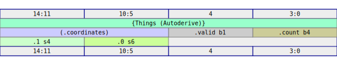
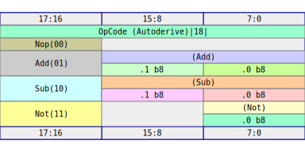

# Derive

Having written the `impl Digital` for `Things` and `OpCode` manually, you can now replace all of that with a simple `#[derive(Digital)]` annotation on your data structures.  We can update our struct example from [Struct](structs.md) to contain only the following:

```rust
{{#rustdoc_include ../code/src/digital/derive_ex.rs:struct}}
```

This is completely equivalent to our hand rolled implementation of `impl Digital`. 

The needed methods will be autogenerated by the proc-macro.  As before:

- Fields are packed in order, least significant bit first
- Zero sized types are dropped
- `dont_care` is assembled from a `dont_care` value for each field.

 We can still get an SVG of the layout by running the same test as before, with an upated test:

```rust
{{#rustdoc_include ../code/src/digital/derive_ex.rs:main}}
```
and confirm that the resulting SVG is the same as before:


You can now see the precise layout of the fields in the struct, as well as the elimination of the ZST field.  Compare to [the hand rolled version](structs.md) to confirm they are the same.

We can similarly add a `#[derive(Digital)]` to our `OpCode` enum, but the result is not _quite_ the same:

```rust
{{#rustdoc_include ../code/src/digital/derive_enum.rs:enum}}
```

We see that this does _not_ compile.  

<!-- cmdrun to-html "cd ../code && cargo check --features no-default-impl 2>&1" -->

The error is a hint.  The macro needs a way to define `dont_care`, and thus, it needs a way to signal which value of the `enum` to use when we need a placeholder value in our code.  I opted to use `Default` as the way to signal which value is a `dont_care`, so we need to add that to the list or add a manual `impl Default`.  For now, we will use the `#[derive(Default)]` macro and tag `Nop` as the safe option to use for a placeholder.

```rust
{{#rustdoc_include ../code/src/digital/derive_enum.rs:enum-fixed}}
```

With the following test definition:

```rust
{{#rustdoc_include ../code/src/digital/derive_enum.rs:main}}
```

we get the following SVG layout:



You can compare this to the hand rolled version from [Enums](enums.md) to see that the layout is the same.

```admonish note
By default, `RHDL` uses the same logic as `rustc` to assign discriminant values to the variants of an enum.  The rules are documented [here](https://doc.rust-lang.org/reference/items/enumerations.html#r-items.enum.discriminant.implicit).  The summary is:

1. Discriminants without explicit values are assigned `+1` to the previous variant discriminant.
2. If the first discriminant has no value, then it is assigned to `0`.

If you want explicit control over the discriminants, I cover that later in [Advanced](advanced.md).
```
