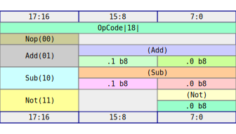

# Derive

Having written the `impl Digital` for `Things` and `OpCode` manually, you can now replace all of that with a simple `#[derive(Digital)]` annotation on your data structures.  We can update our `things.rs` file to contain only this:

```rust,write:digital/src/things.rs
use rhdl::prelude::*;

//                                 👇 - New!
#[derive(Copy, PartialEq, Clone, Digital)]
pub struct Things {
    pub count: b4,
    pub valid: bool,
    pub coordinates: (s6, s4),
    pub zst: (),
}
```

The needed methods will be autogenerated by the proc-macro.  As before:

- Fields are packed in order, least significant bit first
- Zero sized types are dropped
- `dont_care` is assembled from a `dont_care` value for each field.

We can rerun the test:

```shell,rhdl:digital
cargo build -q
cargo nextest run
```

and confirm that the resulting SVG is the same as before:

```shell,rhdl-silent:digital
cp things.svg $ROOT_DIR/src/img/things_v2.svg
```

The result is the following handy SVG map of the layout of our type:


You can now see the precise layout of the fields in the struct, as well as the elimination of the ZST field.

We can similarly add a `#[derive(Digital)]` to our `OpCode` enum, but the result is not _quite_ the same:

```rust,write:digital/src/opcode.rs
use rhdl::prelude::*;

//                                 👇 - New!
#[derive(Copy, PartialEq, Clone, Digital)]
pub enum OpCode {
    Nop,
    Add(b8, b8),
    Sub(b8, b8),
    Not(b8),
}
```

We see that this does _not_ compile.  

```shell,rhdl:digital
cargo check -q
```

The error is a hint.  The macro needs a way to define `dont_care`, and thus, it needs a way to signal which value of the `enum` to use when we need a placeholder value in our code.  I opted to use `Default` as the way to signal which value is a `dont_care`, so we need to add that to the list or add a manual `impl Default`.  For now, we will use the `#[derive(Default)]` macro and tag `Nop` as the safe option to use for a placeholder.

```rust,write:digital/src/opcode.rs
use rhdl::prelude::*;

//                                         👇 - New!
#[derive(Copy, PartialEq, Clone, Digital, Default)]
pub enum OpCode {
    #[default] // 👈 - New!
    Nop,
    Add(b8, b8),
    Sub(b8, b8),
    Not(b8),
}
```

```admonish note
By default, `RHDL` uses the same logic as `rustc` to assign discriminant values to the variants of an enum.  The rules are documented [here](https://doc.rust-lang.org/reference/items/enumerations.html#r-items.enum.discriminant.implicit).  The summary is:

1. Discriminants without explicit values are assigned `+1` to the previous variant discriminant.
2. If the first discriminant has no value, then it is assigned to `0`.

If you want explicit control over the discriminants, I cover that later.
```

Our tests now compile and run successfully, and the layout is the same as before.

```shell,rhdl:digital
cargo build -q
cargo nextest run
```

```shell,rhdl-silent:digital
cp opcode.svg $ROOT_DIR/src/img/opcode_2.svg
```




