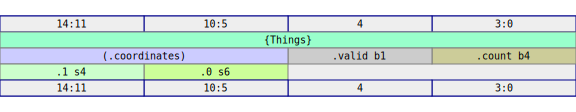

# Structs

It's fairly easy to understand `impl Digital` for structs.  To follow along, create a new project, add the `rhdl` crate as a dependency and add a prelude import to the top of `main.rs`:

```rust
{{#rustdoc_include ../code/src/digital/struct_ex.rs:prelude}}
```

The following struct, for example:

```rust
{{#rustdoc_include ../code/src/digital/struct_ex.rs:struct-definition}}
```

You can `impl Digital` for this type yourself.  It's not difficult, and serves as a good exercise in understanding how little magic there is in the macro that does it for you.  For the number of `BITS`, we have `4 + 1 + 10 + 0 = 15`, so this should be a 15 bit type.

```admonish note
The number of `BITS` used by a `Digital` value is generally unrelated to the `rustc` representation.  A `bool`, for example, only occupies 1 bit in RHDL, not 8.  And a `Bits<N>` bit vector occupies `N` bits in RHDL, but 128 bits in `rustc`.  This difference in representations doesn't generally matter, and you are best off ignoring the details of the Rust in-memory representation of `impl Digital`.
```

The number of `BITS` is an associated constant for the type, so we can add it thusly:


```rust
{{#rustdoc_include ../code/src/digital/struct_ex.rs:struct-BITS}}
```

We see that `Digital: Copy + PartialEq + Clone` (the other requirements are less interesting like `Sized` and `'static`.). So we add these to our `Things` declaration.

```rust
{{#rustdoc_include ../code/src/digital/struct_ex.rs:struct-def-with-derive}}
```

The next thing we need is the `Kind` of this data type.  You can think of this as the run time type information needed to describe the shape of the datastructure to RHDL.  It is completely different than `rustc`s in-memory layout in several ways.  For example, `rustc` will use 8 bits for a boolean, we will use 1 bit.  `rustc` will use 128 bits for each of the `b4, i6, i4` values (since that is part of their generic representation).  So we need a layout that describes exactly how the `Things` struct is laid out in those 15 bits.  In RHDL, this is captured in the `Kind` type, and you can read the docs for it directly.  We won't go through those docs in detail, but here is what the implementation of `static_kind` might look like:

```rust
{{#rustdoc_include ../code/src/digital/struct_ex.rs:struct-static_kind}}
```

As you can see, it simply delegates to the `static_kind` of each of the fields, enumerates them in the order they appear in the struct, and adds names.   We need only provide two additional methods.  The first packs the data into a bit vector.  We can delegate similarly to the individual fields, and pack them in source-code order (i.e., first field listed occupies the LSBs of the bit vector):

```rust
{{#rustdoc_include ../code/src/digital/struct_ex.rs:struct-bin}}
```

Similarly, the `dont_care` method can be delegated as well:

```rust
{{#rustdoc_include ../code/src/digital/struct_ex.rs:struct-dont_care}}
```

And that is all!  Let's check our definition of our new type.  We can visualize the `Kind` of any `impl Digital` type by rendering it to a handy SVG.  To do so, we can provide the following test function:

```rust
{{#rustdoc_include ../code/src/digital/struct_ex.rs:struct-layout}}
```

If you run the test, it will generate the SVG output



You can now see the precise layout of the fields in the struct, as well as the elimination of the ZST field.