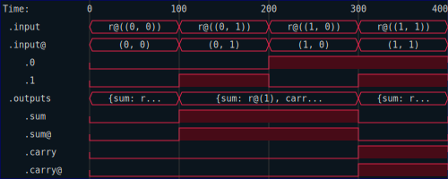
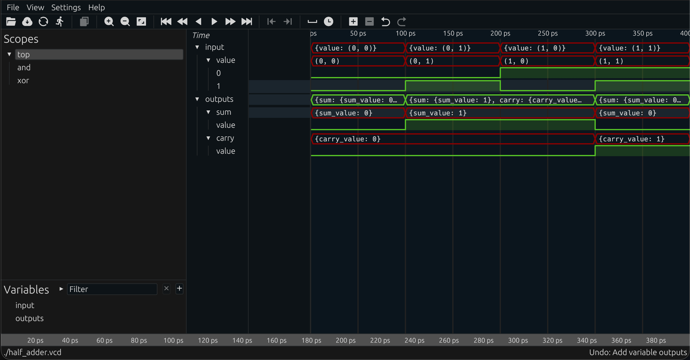

# Testing the Half Adder

Let's test our half adder.  We will skip straight to the iterator based testing methods, since direct testing with explicit calls to `sim` are tedious.  We can again benefit from the fact that the test code is just Rust, and can thus easily compute the expected values using whatever functions we like, without regard for worrying about their synthesizability.

```rust
{{#rustdoc_include ../code/src/half_adder.rs:adder-step-12}}
```

As a reminder, the `run` method on any `Circuit` produces a sequence of `TracedSample<I,O>`, which has
 
- `s.time` the timestamp of the sample (monotonic, but not strictly)
- `s.input` the input signal at that time (of type `Signal<(bool, bool), Red>`)
- `s.output` the output signal at that time (of type `Outputs`)

Let us also make a Verilog testbench that validates our translation of the code for synthesis.

```rust
{{#rustdoc_include ../code/src/half_adder.rs:adder-step-13}}
```

We can generate the testbench file by running the test.  The resulting Verilog file is

```verilog
{{#include ../code/half_rtl_tb.v}}
```

We can again test it using `icarus`

<!-- cmdrun to-html "cd ../code && iverilog half_rtl_tb.v && ./a.out" -->

We can also generate a netlist representation and test that

```rust
{{#rustdoc_include ../code/src/half_adder.rs:adder-step-14}}
```

We can generate the testbench file again, and run it through `icarus`:

<!-- cmdrun to-html "cd ../code && iverilog half_ntl_tb.v && ./a.out" -->

Finally, we can generate a trace file to see the test cases as a timeseries

```rust
{{#rustdoc_include ../code/src/half_adder.rs:adder-step-15}}
```

The resulting SVG shows the input and output signals as one would expect for a trace file.



Alternately, we can generate a VCD trace file by collecting into the `VcdFile` container:

```rust
{{#rustdoc_include ../code/src/half_adder.rs:adder-step-16}}
```


