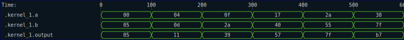
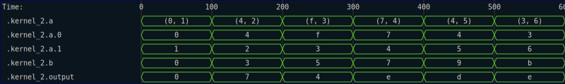
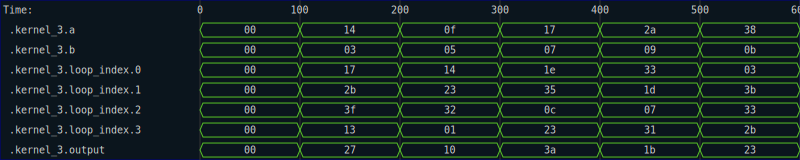
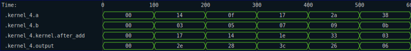
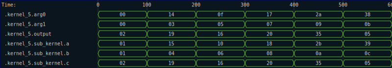
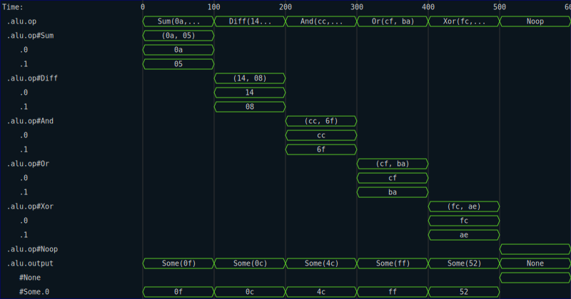
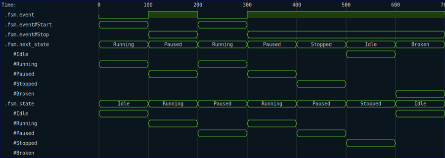
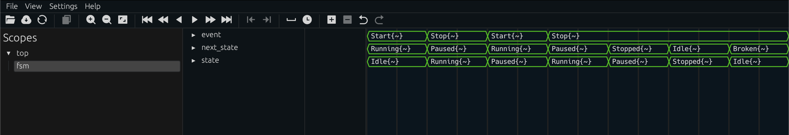

# Tracing

Kernel functions are _almost_ pure.  The exception is tracing, which is a write-only side effect that allows you to expose variables expressions from inside your design to RHDL's simulation engine.  These are useful when you are trying to debug issues in your design, and simply seeing the inputs and outputs of the kernel are not sufficient.

In these cases, you can use the tracing functionality to add any `impl Digital` to your trace output.  You can even trace values conditionally, so that they appear in the trace output only when needed.  

```admonish note
When working with `Circuit` and `Synchronous`, inputs and outputs to the kernels are automatically traced in the generated code.  You don't need to explicitly trace unless you are interested in some internal detail of a kernel that isn't exposed via it's arguments or return types.
```

To demonstrate some examples of using tracing, we will first create an empty project.

```shell,rhdl-silent
rm -rf trace
```

```shell,rhdl
cargo new --lib trace
cd trace
cargo add --path ~samitbasu/Devel/rhdl/crates/rhdl
cargo add --dev miette
```

```shell,rhdl-silent
mkdir -p trace/tests
```

## Simplest Case

The first test case, simply logs the inputs and outputs of the kernel.  Again, you don't normally need to do this if the kernel is attached to a `Circuit` or `Synchronous`.  

```rust,write:trace/tests/test_kernel1.rs
use rhdl::prelude::*;

#[kernel]
fn kernel_1(a: b8, b: b8) -> b8 {
    trace("a", &a);
    trace("b", &b);
    let output = a + b;
    trace("output", &output);
    output
}

#[test]
fn test_kernel_1() {
    let a_set = [0, 4, 15, 23, 42, 56];
    let b_set = [5, 13, 42, 64, 85, 127];
    let inputs = a_set
        .iter()
        .zip(b_set.iter())
        .map(|(&a, &b)| (b8::from(a), b8::from(b)));
    let guard = trace_init_db();
    for (ndx, (a, b)) in inputs.enumerate() {
        trace_time((ndx * 100) as u64);
        let _ = kernel_1(a, b);
    }
    let options = SvgOptions::default();
    let svg = guard.take().dump_svg(0..=600, &options);
    std::fs::write("tracing_demo.svg", svg.to_string()).unwrap();
}
```

```shell,rhdl-silent:trace
cargo check -q
cargo nextest run 
cp tracing_demo.svg $ROOT_DIR/src/img/.
```

Running this test generates the following SVG, showing a simple VCD trace of the calls to the kernel function.




## Tracing complex types

The arguments to the kernel (and indeed anything sent to the `trace` function) can be any type that `impl Digital`.  For example, in the next kernel, we pass a tuple of nibbles for the first argument.

```rust,write:trace/tests/test_kernel2.rs
use rhdl::prelude::*;
#[kernel]
fn kernel_2(a: (b4, b4), b: b4) -> b4 {
    trace("a", &a);
    trace("b", &b);
    let output = a.0 + b;
    trace("output", &output);
    output
}

#[test]
fn test_kernel_2() {
    let a_set = [(0, 1), (4, 2), (15, 3), (7, 4), (4, 5), (3, 6)];
    let b_set = [0, 3, 5, 7, 9, 11];
    let inputs = a_set
        .iter()
        .zip(b_set.iter())
        .map(|(&a, &b)| ((b4::from(a.0), b4::from(a.1)), b4::from(b)));
    let guard = trace_init_db();
    for (ndx, (a, b)) in inputs.enumerate() {
        trace_time((ndx * 100) as u64);
        let _ = kernel_2(a, b);
    }
    let options = SvgOptions::default();
    let svg = guard.take().dump_svg(0..=600, &options);
    std::fs::write("tracing_demo_2.svg", svg.to_string()).unwrap();
}
```

```shell,rhdl-silent:trace
cargo nextest run
cp tracing_demo_2.svg $ROOT_DIR/src/img/.
```




## Trace Keys

The first argument to the `trace` call does not need to be a static string.  It can also be constructed from tuples of strings and integers.  This is handy for making structured keys that can be used to differentiate between instances of the traced data.  For example, consider the next kernel, which uses a `for` loop to count the number of ones in a value:

```rust,write:trace/tests/test_kernel3.rs
use rhdl::prelude::*;

#[kernel]
fn kernel_3(a: b6, b: b6) -> b6 {
    trace("a", &a);
    trace("b", &b);
    let mut c = a + b;
    for i in 0..4 {
        trace(("loop_index", i), &c);
        c += a;
    }
    let output = c;
    trace("output", &output);
    output
}

#[test]
fn test_kernel_3() {
    let a_set = [0, 20, 15, 23, 42, 56];
    let b_set = [0, 3, 5, 7, 9, 11];
    let inputs = a_set
        .iter()
        .zip(b_set.iter())
        .map(|(&a, &b)| (b6::from(a), b6::from(b)));
    let guard = trace_init_db();
    for (ndx, (a, b)) in inputs.enumerate() {
        trace_time((ndx * 100) as u64);
        let _ = kernel_3(a, b);
    }
    let options = SvgOptions::default();
    let svg = guard.take().dump_svg(0..=600, &options);
    std::fs::write("tracing_demo_3.svg", svg.to_string()).unwrap();
}
```

```shell,rhdl-silent:trace
cargo nextest run
cp tracing_demo_3.svg $ROOT_DIR/src/img/.
```

In the resulting trace, you can see that each iteration of the loop is traced as a different signal, giving clear visibility into the quantity being traced, even though it is being mutated in place.




Here is another example, in which the custom key is based on two strings instead.

```rust,write:trace/tests/test_kernel4.rs
use rhdl::prelude::*;

#[kernel]
fn kernel_4(a: b6, b: b6) -> b6 {
    trace("a", &a);
    trace("b", &b);
    let c = a + b;
    trace(("kernel", "after_add"), &c);
    let output = c + c;
    trace("output", &output);
    output
}

#[test]
fn test_kernel_4() {
    let a_set = [0, 20, 15, 23, 42, 56];
    let b_set = [0, 3, 5, 7, 9, 11];
    let inputs = a_set
        .iter()
        .zip(b_set.iter())
        .map(|(&a, &b)| (b6::from(a), b6::from(b)));
    let guard = trace_init_db();
    for (ndx, (a, b)) in inputs.enumerate() {
        trace_time((ndx * 100) as u64);
        let _ = kernel_4(a, b);
    }
    let options = SvgOptions::default();
    let svg = guard.take().dump_svg(0..=600, &options);
    std::fs::write("tracing_demo_4.svg", svg.to_string()).unwrap();
}
```

```shell,rhdl-silent:trace
cargo nextest run
cp tracing_demo_4.svg $ROOT_DIR/src/img/.
```

This use case is mostly used by auto-generated code, but you may find it useful when trying to label and isolate certain trace data.



## Function nesting

RHDL automatically inserts a path-like prefix at the beginning of every synthesizable function (and then removes it at the end of that function).  If you do not trace any values out in the called function, this does nothing, but if you _do_ trace values from a called function, then the path information tells you both _where_ the values were traced from, and _how_ you got to that function.  Both can be very helpful when trying to track down where a certain data element came from.  We can demonstrate that with another contrived example:

```rust,write:trace/tests/test_kernel5.rs
use rhdl::prelude::*;

#[kernel]
fn sub_kernel(a: b6, b: b6) -> b6 {
    trace("a", &a);
    trace("b", &b);
    let c = a + b;
    trace("c", &c);
    c
}

#[kernel]
fn kernel_5(arg0: b6, arg1: b6) -> b6 {
    trace("arg0", &arg0);
    trace("arg1", &arg1);
    let output = sub_kernel(arg0 + 1, arg1 + 1);
    trace("output", &output);
    output
}

#[test]
fn test_kernel_5() {
    let a_set = [0, 20, 15, 23, 42, 56];
    let b_set = [0, 3, 5, 7, 9, 11];
    let inputs = a_set
        .iter()
        .zip(b_set.iter())
        .map(|(&a, &b)| (b6::from(a), b6::from(b)));
    let guard = trace_init_db();
    for (ndx, (a, b)) in inputs.enumerate() {
        trace_time((ndx * 100) as u64);
        let _ = kernel_5(a, b);
    }
    let options = SvgOptions::default();
    let svg = guard.take().dump_svg(0..=600, &options);
    std::fs::write("tracing_demo_5.svg", svg.to_string()).unwrap();
}
```

```shell,rhdl-silent:trace
cargo nextest run
cp tracing_demo_5.svg $ROOT_DIR/src/img/.
```



## Tracing with Enums

RHDL provides extensive support of `enum` values when tracing.  The following (slightly less trivial) example, shows how a series of `enum` values are represented in a trace.  

```rust,write:trace/tests/test_alu.rs
use rhdl::prelude::*;

#[derive(Copy, Clone, PartialEq, Digital, Default)]
pub enum OpCode {
    Sum(b8, b8),
    Diff(b8, b8),
    And(b8, b8),
    Or(b8, b8),
    Xor(b8, b8),
    #[default]
    Noop,
}

#[kernel]
fn alu(op: OpCode) -> Option<b8> {
    trace("op", &op);
    let output = match op {
        OpCode::Sum(a, b) => Some(a + b),
        OpCode::Diff(a, b) => Some(a - b),
        OpCode::And(a, b) => Some(a & b),
        OpCode::Or(a, b) => Some(a | b),
        OpCode::Xor(a, b) => Some(a ^ b),
        OpCode::Noop => None,
    };
    trace("output", &output);
    output
}

#[test]
fn test_alu() {
    let ops = [
        OpCode::Sum(b8::from(10), b8::from(5)),
        OpCode::Diff(b8::from(20), b8::from(8)),
        OpCode::And(b8::from(0b11001100), b8::from(0b01101111)),
        OpCode::Or(b8::from(0b11001111), b8::from(0b10111010)),
        OpCode::Xor(b8::from(0b11111100), b8::from(0b10101110)),
        OpCode::Noop,
    ];
    let guard = trace_init_db();
    for (ndx, op) in ops.iter().enumerate() {
        trace_time((ndx * 100) as u64);
        let _ = alu(*op);
    }
    let options = SvgOptions::default();
    let svg = guard.take().dump_svg(0..=600, &options);
    std::fs::write("tracing_demo_alu.svg", svg.to_string()).unwrap();
}
```

```shell,rhdl-silent:trace
cargo nextest run
cp tracing_demo_alu.svg $ROOT_DIR/src/img/.
```

Note that the trace conveys the value of the discriminant in each time interval, as well as the payload data when that variant is selected.



Finally, another use case for `enum` values in hardware design is as states in finite state machines.  Even if the `enum` carries no data (i.e., it is a `C-like` enum), it can be helpful when tracing to have the name of the variant appear in the trace file instead of the numeric value.  Here is an example of a kernel that runs a very simple finite state machine and logs the current and next state out to a trace file.

```rust,write:trace/tests/test_fsm.rs
use rhdl::prelude::*;

#[derive(Copy, Clone, PartialEq, Digital, Default)]
pub enum State {
    #[default]
    Idle,
    Running,
    Paused,
    Stopped,
    Broken,
}

#[derive(Copy, Clone, PartialEq, Digital, Default)]
pub enum Event {
    #[default]
    Start,
    Stop,
}

#[kernel]
fn fsm(state: State, event: Event) -> State {
    trace("state", &state);
    trace("event", &event);
    let next_state = match (state, event) {
        (State::Idle, Event::Start) => State::Running,
        (State::Running, Event::Stop) => State::Paused,
        (State::Paused, Event::Start) => State::Running,
        (State::Paused, Event::Stop) => State::Stopped,
        (State::Stopped, Event::Stop) => State::Idle,
        _ => State::Broken,
    };
    trace("next_state", &next_state);
    next_state
}

#[test]
fn test_fsm() {
    let events = [
        Event::Start,
        Event::Stop,
        Event::Start,
        Event::Stop,
        Event::Stop,
        Event::Stop,
        Event::Stop,
    ];
    let mut state = State::Idle;
    let guard = trace_init_db();
    for (ndx, event) in events.iter().enumerate() {
        trace_time((ndx * 100) as u64);
        state = fsm(state, *event);
    }
    let options = SvgOptions::default();
    let svg = guard.take().dump_svg(0..=700, &options);
    std::fs::write("tracing_demo_fsm.svg", svg.to_string()).unwrap();
}
```

```shell,rhdl-silent:trace
cargo nextest run
cp tracing_demo_fsm.svg $ROOT_DIR/src/img/.
```

I have found the resulting trace much easier to interpret than one that requires I refer back to a set of numeric definitions for each of the state discriminants to decide what state the FSM is in at any given time.  Note that you can still 1-hot encode the states using `rustc`'s standard notation for hardwired discriminants.  The labels are still useful.



Finally, the generated VCDs should be viewable with standard tools, although how much type information gets rendered is dependent on the viewer.  

```rust,write:trace/tests/test_fsm_vcd.rs
# use rhdl::prelude::*;
#
# #[derive(Copy, Clone, PartialEq, Digital, Default)]
# pub enum State {
#     #[default]
#     Idle,
#     Running,
#     Paused,
#     Stopped,
#     Broken,
# }
# 
# #[derive(Copy, Clone, PartialEq, Digital, Default)]
# pub enum Event {
#     #[default]
#     Start,
#     Stop,
# }
# 
# #[kernel]
# fn fsm(state: State, event: Event) -> State {
#     trace("state", &state);
#     trace("event", &event);
#     let next_state = match (state, event) {
#         (State::Idle, Event::Start) => State::Running,
#         (State::Running, Event::Stop) => State::Paused,
#         (State::Paused, Event::Start) => State::Running,
#         (State::Paused, Event::Stop) => State::Stopped,
#         (State::Stopped, Event::Stop) => State::Idle,
#         _ => State::Broken,
#     };
#     trace("next_state", &next_state);
#     next_state
# }
# 
#[test]
fn test_fsm_2() {
    let events = [
        Event::Start,
        Event::Stop,
        Event::Start,
        Event::Stop,
        Event::Stop,
        Event::Stop,
        Event::Stop,
    ];
    let mut state = State::Idle;
    let guard = trace_init_db();
    for (ndx, event) in events.iter().enumerate() {
        trace_time((ndx * 100) as u64);
        state = fsm(state, *event);
    }
    let mut file = std::fs::File::create("tracing_demo_fsm.vcd").unwrap();
    guard.take().dump_vcd(&mut file, None).unwrap();
}
```

Here is a screenshot of that VCD being rendered in a version of `surfer`:



