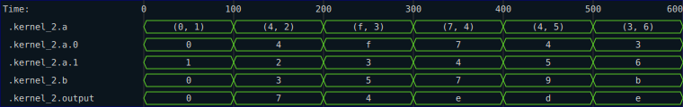

# Complex Types

The arguments to the kernel (and indeed anything sent to the `trace` function) can be any type that `impl Digital`.  For example, in the next kernel, we pass a tuple of nibbles for the first argument.

```rust
{{#rustdoc_include ../../code/src/kernels/tracing/complex.rs:step_1}}
```

Exercising this kernel with tracing looks like this:
```rust
{{#rustdoc_include ../../code/src/kernels/tracing/complex.rs:step_1_test}}
```

The resulting SVG looks like this:


