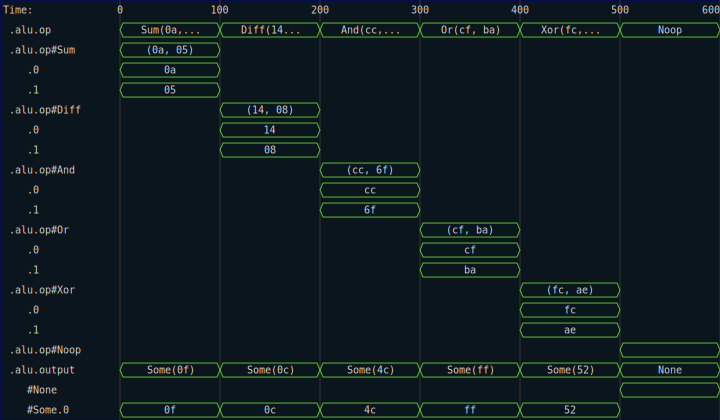
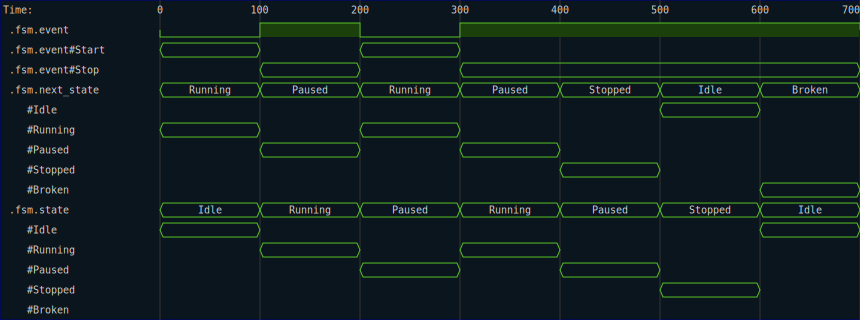

# Enums

RHDL provides extensive support of `enum` values when tracing.  The following (slightly less trivial) example, shows how a series of `enum` values are represented in a trace.  

```rust
{{#rustdoc_include ../../code/src/kernels/tracing/enums.rs:step_1}}
```

With the following test function: 

```rust
{{#rustdoc_include ../../code/src/kernels/tracing/enums.rs:step_1_test}}
```

Note that the trace conveys the value of the discriminant in each time interval, as well as the payload data when that variant is selected.



Finally, another use case for `enum` values in hardware design is as states in finite state machines.  Even if the `enum` carries no data (i.e., it is a `C-like` enum), it can be helpful when tracing to have the name of the variant appear in the trace file instead of the numeric value.  Here is an example of a kernel that runs a very simple finite state machine and logs the current and next state out to a trace file.

We start with an enum that defines the states of the FSM:

```rust
{{#rustdoc_include ../../code/src/kernels/tracing/enums.rs:step_2_state}}
```

We also define an enum for the events that drive the state transitions:

```rust
{{#rustdoc_include ../../code/src/kernels/tracing/enums.rs:step_2_event}}
```

And finally, we write a kernel that implements the FSM logic:

```rust
{{#rustdoc_include ../../code/src/kernels/tracing/enums.rs:step_2_kernel}}
```

We can write a simple test function to exercise the FSM and generate a trace file:

```rust
{{#rustdoc_include ../../code/src/kernels/tracing/enums.rs:step_2_test}}
```

I have found the resulting trace much easier to interpret than one that requires I refer back to a set of numeric definitions for each of the state discriminants to decide what state the FSM is in at any given time.  Note that you can still 1-hot encode the states using `rustc`'s standard notation for hardwired discriminants.  The labels are still useful.



Finally, the generated VCDs should be viewable with standard tools, although how much type information gets rendered is dependent on the viewer.  

```rust
{{#rustdoc_include ../../code/src/kernels/tracing/enums.rs:step_2_vcd}}
```

Here is a screenshot of that VCD being rendered in a version of `surfer`:


