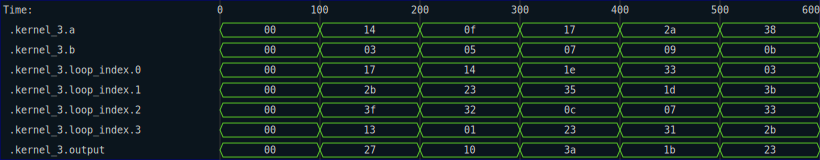
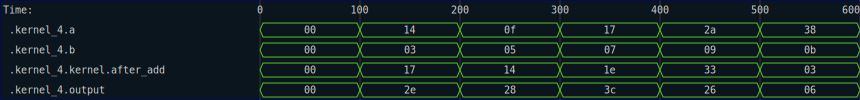

# Trace Keys

The first argument to the `trace` call does not need to be a static string.  It can also be constructed from tuples of strings and integers.  This is handy for making structured keys that can be used to differentiate between instances of the traced data.  For example, consider the next kernel, which uses a `for` loop to count the number of ones in a value:

```rust
{{#rustdoc_include ../../code/src/kernels/tracing/keys.rs:step_1}}
```

Here is an example of explicit tracing of the kernel

```rust
{{#rustdoc_include ../../code/src/kernels/tracing/keys.rs:step_1_test}}
```

In the resulting trace, you can see that each iteration of the loop is traced as a different signal, giving clear visibility into the quantity being traced, even though it is being mutated in place.




Here is another example, in which the custom key is based on two strings instead.

```rust
{{#rustdoc_include ../../code/src/kernels/tracing/keys.rs:step_2}}
```

This use case is mostly used by auto-generated code, but you may find it useful when trying to label and isolate certain trace data. With the following test function:

```rust
{{#rustdoc_include ../../code/src/kernels/tracing/keys.rs:step_2_test}}
```

The resulting trace looks like this:


