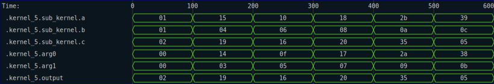

# Function Nesting

RHDL automatically inserts a path-like prefix at the beginning of every synthesizable function (and then removes it at the end of that function).  If you do not trace any values out in the called function, this does nothing, but if you _do_ trace values from a called function, then the path information tells you both _where_ the values were traced from, and _how_ you got to that function.  Both can be very helpful when trying to track down where a certain data element came from.  We can demonstrate that with another contrived example:

```rust
{{#rustdoc_include ../../code/src/kernels/tracing/nesting.rs:step_1}}
```

and the following test function:

```rust
{{#rustdoc_include ../../code/src/kernels/tracing/nesting.rs:step_1_test}}
```


