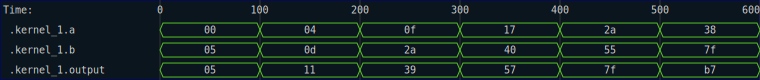

# Simple Cases

The first test case, simply logs the inputs and outputs of the kernel.  Again, you don't normally need to do this if the kernel is attached to a `Circuit` or `Synchronous`.  However, there may be circumstances in which you want to trace a bit of logic without wrapping it into a full circuit.  Here is an example of using the low level trace types.

Suppose we have the following trivial kernel:

```rust
{{#rustdoc_include ../../code/src/kernels/tracing/simple.rs:step_1}}
```

And suppose we want to exercise this kernel through a set of inputs without wrapping it into a full `Circuit` (which is the easiest way to get tracing support automatically).  We can do this using the `Session` and `Svg` or `Vcd` types.  An example of such a test would look something like this:

```rust
{{#rustdoc_include ../../code/src/kernels/tracing/simple.rs:step_1_test}}
```

and running the test would result in the following SVG output:



