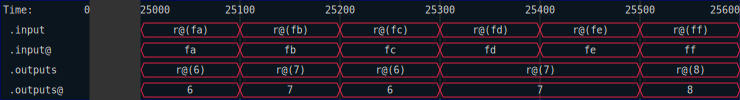
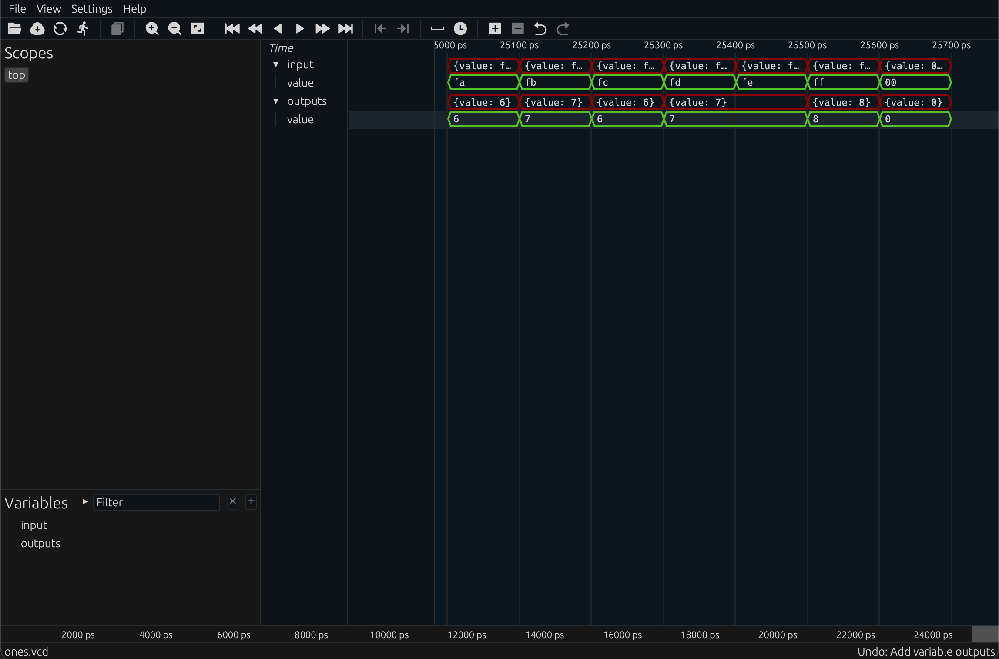

# Testing the One Counter

Let's test our one-counter.  We will again use iterator-based testing, since this circuit is simple enough to use.  

```rust
{{#rustdoc_include ../code/src/count_ones.rs:ones-step-5}}
```

Here, we use the Rust `count_ones()` method to get the expected output, and thus trivially check that our naive implementation gets the right answer.  Note that you can call `.raw()` on a `Bits` type to get the underlying `u128` representation, but not in synthesizable code (i.e., not in a kernel).  

<!-- cmdrun to-html "cd ../code && cargo test --package code --lib -- count_ones::step_4::test_ones_counter --exact --nocapture " -->

We can also make a Verilog testbench that validates our translation of the code for synthesis.  Here, it is handy that `rustc` computed the expected values for us - the test is now checking the Verilog against the Rust.  Correctness of the Rust code was already established above.

```rust
{{#rustdoc_include ../code/src/count_ones.rs:ones-step-6}}
```

We can run the generated testbench through `icarus` like so:

<!-- cmdrun to-html "cd ../code && iverilog ones_rtl_tb.v && ./a.out" -->

We can also generate the netlist representation and test that instead.  Note that the netlist representation is a lower level and used more for analysis.  


```rust
{{#rustdoc_include ../code/src/count_ones.rs:ones-step-7}}
```

If you look at the output of the netlist, it looks slightly cleaner than the output of the RTL.  You can think of the RTL as only lightly optimized, and the netlist as more heavily optimized.  Those optimizations can yield much leaner structures, but also make it harder to trace back to the original Rust source.

And running it through `icarus`:

<!-- cmdrun to-html "cd ../code && iverilog ones_ntl_tb.v && ./a.out" -->

Finally, we can generate a trace file to see the test cases as a timeseries.  A useful technique demonstrated here is filtering out the timestamps to only keep a small section of the trace.  The filtering can be arbitrary.  So if you only want to keep timestamps once a certain condition is met, you can easily do so...  

```rust
{{#rustdoc_include ../code/src/count_ones.rs:ones-step-8}}
```

The resulting SVG shows the input and output signals as one would expect for a trace file.



Finally, we can generate a traditional VCD file if desired:

```rust
{{#rustdoc_include ../code/src/count_ones.rs:ones-step-9}}
```


