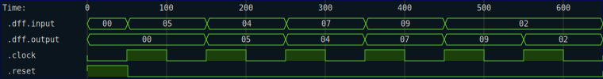

# Synchronous Sample

Occaisionally, when working with synchronous circuits, you want your test function to behave as if it were itself synchronous.  In that case, you want it sample the inputs and outputs of the circuit under test only on clock edges.  The `synchronous_sample` probe provides this functionality.

```rust
{{#rustdoc_include ../../code/src/probes.rs:synchronous-sample-trait}}
```

Note that unlike the other probes, this one is implemented only for iterators that yield `TracedSample<(ClockReset, I), O>` values, since it needs access to the clock signal to determine when to sample. 


To explain the operation of `synchronous_sample`, consider the following timing diagram:

```badascii
              +------+      +------+       
clock         |      |      |      |       
        +-----+      +------+      +------+
                                           
input   ++I0+-+----+I1+-----+-----+I2+----+
        +-----+-------------+-------------+
                                           
output  ++O0+-+----+O1+-----+-----+O2+----+
        +-----+-------------+-------------+
```

In this case, no causal relationship is assumed between the input and output values.  The latency between the input and output value streams is not specified.  

To contrast with [Sample At Neg Edge](sample_at_neg_edge.md), which samples the output on the falling edge of the clock, `synchronous_sample` samples both the input and output streams on the rising edge of the clock.  This means that at each rising edge of the clock, the probe yields a sample containing the input and output values at that time.

Here is an example of using the `synchronous_sample` probe on a simple 8-bit wide digital flip-flop:

```rust
{{#rustdoc_include ../../code/src/probes.rs:synchronous-sample-demo}}
```

For reference, here is the trace of this simulation:



The iterator produces only a set of values at the rising edge of the clock, and discards all others.  

{{#include ../../code/dff_synchronous_sample.txt}}

