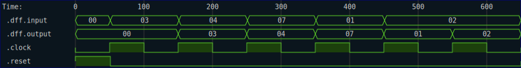
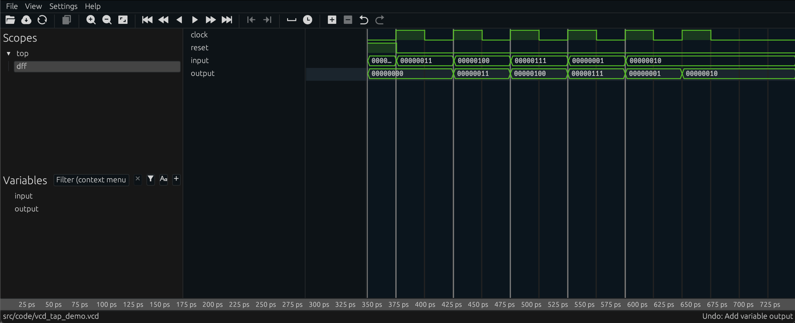

# Trace Taps

Trace taps provide a way to generate trace files from the output of a simulation without consuming the output stream.  This is similar to the `.inspect` method on iterators, but instead of simply inspecting the values, trace taps write the values to a trace file in a specified format.  There are two trace taps provided by RHDL:

- VCD (Value Change Dump) Tap, using the `.vcd_tap` extension trait
- SVG (Scalable Vector Graphics) Tap, using the `.svg_tap` extension trait

The extension traits for taps look like this:

```rust
{{#rustdoc_include ../../code/src/probes.rs:tap-trait}}
```

To use a trace tap, you simply add it to the iterator chain of your simulation.  For example, consider the following simple test case

```rust
{{#rustdoc_include ../../code/src/probes.rs:no-trace-tap}}
```

Here, we generate a sequence of input test data, and then run it through a single DFF.  We collect the output into a vector and assert that it is correct.

Suppose we now want to generate trace files from this iterator chain without loosing the output of the simulation.  We can add a `svg_tap` to the iterator chain:

```rust
{{#rustdoc_include ../../code/src/probes.rs:with-svg-tap}}
```

Note that we put the `svg_tap` before any other probes that may filter the output stream, so that we get a complete trace of the simulation.  

The SVG file shows the full trace:



We can also add a VCD tap to the iterator chain to generate a VCD file:

```rust
{{#rustdoc_include ../../code/src/probes.rs:with-vcd-tap}}
```

A screenshot of the resulting VCD file is shown below:



