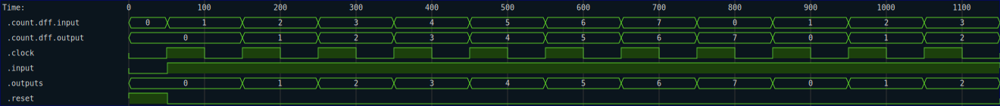
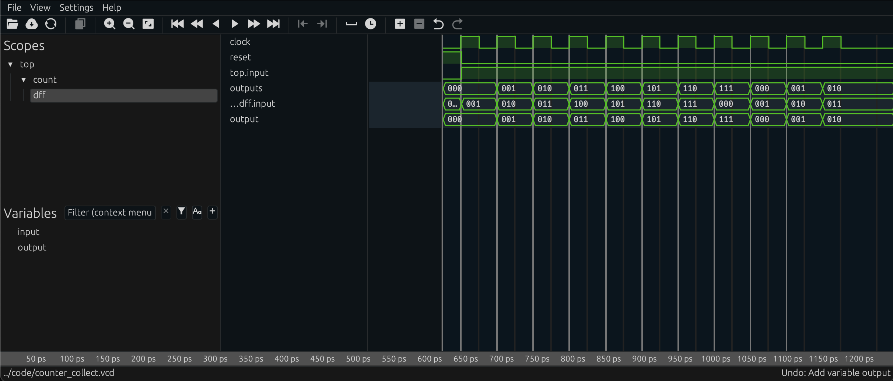
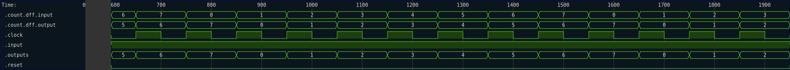
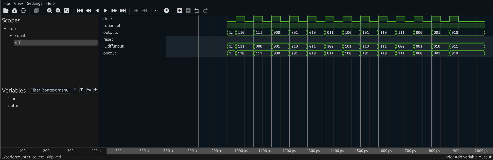
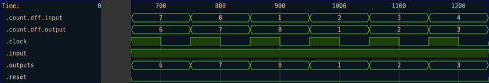
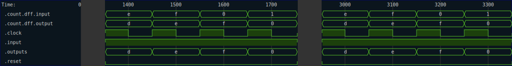

# Tracing

Tracing in RHDL simulations allows you to record the values of signals over time during a simulation run. This is particularly useful for debugging and analyzing the behavior of your digital designs.  While you can use low-level methods to record traces, it is much easier and ergonomic to use the provided iterator-centric tracing methods.  

There are two ways to generate trace files easily from your simulation output:

- Use the container types that collect `TracedSample` items into a complete trace, which can then be exported to a given format.
- Use trace taps, as described in [Trace Taps](probes/trace_taps.md), which can be added to the iterator chain to generate trace files on-the-fly without consuming the output stream.

Note that _what_ gets put into the trace is determined by the trace annotations on the kernel functions of the circuit itself.  See [Tracing Kernels](../kernels/tracing/summary.md) for more information on how to annotate your kernels for tracing.  By default, RHDL will trace all inputs and outputs of kernels.  

Lets start with the simple example of collecting a set of `TracedSample` items into a `SvgFile` container:

```rust
{{#rustdoc_include ../code/src/trace.rs:svg-collect}}
```

This code runs a simple 8-bit counter circuit for 10 clock cycles, collecting the output samples into an `SvgFile` container.  The `SvgFile` container can then be exported to an SVG file using the `write_to_file` method.  The result is a waveform trace that looks like this:



If we wanted to collect into a VCD instead, we could use the `VcdFile` container in a similar way:

```rust
{{#rustdoc_include ../code/src/trace.rs:vcd-collect}}
```

The resulting VCD as rendered in Surfer looks like this:


There is an additional feature you can use in RHDL to control exactly _when_ samples are recorded into the trace.  The `TimedSample` struct carries a flag that indicates whether the sample should be traced or not.  By default, all samples are traced, but you can modify this behavior using using standard iterator methods like `map` to set or clear the trace flag on individual samples.  

## Requesting simulation without tracing

We can request that the simulation not trace the kernels by setting the `untrace` flag on the `TimedSample` items that pass into the simulation.  For example suppose we want to start tracing our counter only after the first 6 clock cycles have passed.  We can do that by mapping over the input iterator to set the `untrace` flag for the first 6 samples:

```rust
{{#rustdoc_include ../code/src/trace.rs:collect_svg_trace_skip_before}}
```

The resulting SVG shows the trace starting only after time `600`:



The same technique can be used with VCD traces as well:

```rust
{{#rustdoc_include ../code/src/trace.rs:collect_vcd_trace_skip_before}}
```

The resulting VCD trace looks like this:



## Dropping trace information post simulation

The previous method works well if you know ahead of time when you want to start or stop tracing.  However, sometimes you may want to make this decision after the circuit simulation has been run.  The most frequeny use case is when you want to start tracing when something happens on the output of the circuit.  For example, if we are interested in the roll-over behavior of our counter, we may want to only start tracing when the value reaches a critical threshold.

To drop trace information from a `TracedSample`, simply call the `.drop_trace()` method on the sample.  This is less efficient that using `.untrace()` on the input, since the trace information is still collected during the simulation, but it is more flexible since you can make the decision based on the output values.  You can also simply drop the samples prior to collecting them into the container.

Here is a simple demo that drops trace information until the output is close to the roll over, and then takes only 20 samples after that:

```rust
{{#rustdoc_include ../code/src/trace.rs:collect_svg_near_rollover}}
```

The resulting SVG trace looks like this:



## Focusing on specific events

Often, tracing requires collecting mountains of data, and then sifting for the one interesting bit we care about.  Using standard iterator methods means we can generally trigger tracing only when something happens.  But in some cases, we want to know what happened _just before_ something interesting happened.  

RHDL provides the extension trait `AroundEventExt` which provides methods to help with this.  The trait is defined as follows:

```rust
{{#rustdoc_include ../code/src/trace.rs:around-event-trait}}
```

Given an iterator `i`, we can use `i.around_event(before, after, predicate)` to capture `before` samples before the event and `after` samples after the event where the event is defined by the `predicate` function.  For example, suppose we want to capture 5 samples before and 5 samples after each time when the output of our counter rolls over.  We can do that as follows:

```rust
{{#rustdoc_include ../code/src/trace.rs:around-event-test}}
```

The resulting SVG trace looks like this:


