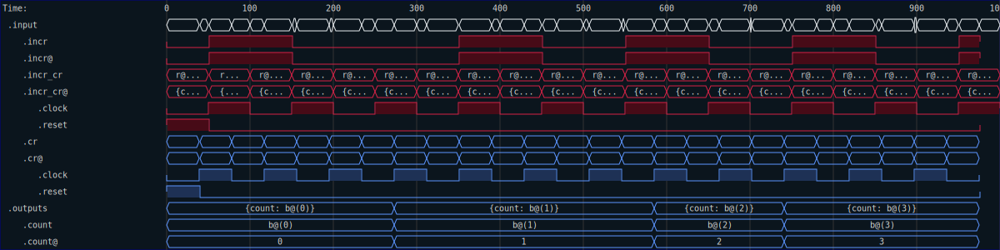
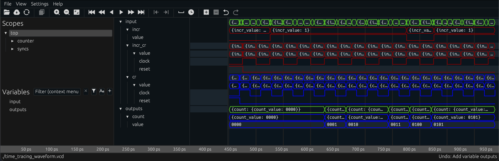

# Tracing

One additional feature of `Timed` signals is that the timing domain of the signals is recorded in any trace file that is generated.  This feature allows you to see (at a glance) which signals belong to with clock domain, even if the clocks are hidden.  That can help with debugging and finding issues with glitches or other timing related problems.  

To demonstrate this feature, you need a VCD viewer that is capable of reading the type information present in the VCD to extract the needed clock domain color for each signal.  But the `SVG` generation built into RHDL can also do this.  To see how, consider the following test of a clock domain crossing counter:


```rust
use rand::random;
use rhdl::prelude::*;
use rhdl_fpga::cdc::cross_counter::{CrossCounter, In};

#[test]
fn make_trace_waveform() -> Result<(), RHDLError> {
    // Start with a stream of pulses
    let red = (0..).map(|_| random::<bool>()).take(100);
    // Clock them on the red domain
    let red = red.with_reset(1).clock_pos_edge(100);
    // Create an empty stream on the blue domain
    let blue = std::iter::repeat(()).with_reset(1).clock_pos_edge(79);
    // Merge them
    let inputs = merge(red, blue, |r: (ClockReset, bool), b: (ClockReset, ())| In {
        incr: signal(r.1),
        incr_cr: signal(r.0),
        cr: signal(b.0),
    });
    // Next we create an instance of the clock-domain crossing core, with
    // the appropriate clock domains.
    let uut = CrossCounter::<Red, Blue, 4>::default();
    // Simulate the crosser, and collect into a VCD
    let vcd = uut
        .run(inputs)
        .take_while(|x| x.time < 1000)
        .collect::<Vcd>();
    let options = SvgOptions {
        label_width: 20,
        ..Default::default()
    }
    .with_io_filter();
    std::fs::write(
        "time_tracing_waveform.svg",
        vcd.dump_svg(&options).to_string(),
    )?;
    Ok(())
}
```

```shell,rhdl-silent
rm -rf time_tracing
rm -rf $ROOT_DIR/src/prj/time_tracing/target
cp -R $ROOT_DIR/src/prj/time_tracing .
cd time_tracing
cargo build -q
cargo nextest run
cp time_tracing_waveform.svg $ROOT_DIR/src/img/.
```

Running this test generates the following SVG



Note that the signals are colored to match the time domain they belong to.  In this case, the input count signal is `incr` and is synchronized to the `Red` clock domain, while the output `count` is synchronized to the `Blue` clock domain.  The circuit accepts both the `Red` and `Blue` clocks as inputs.  In a preview version of `Surfer`, the traces are also colored:


