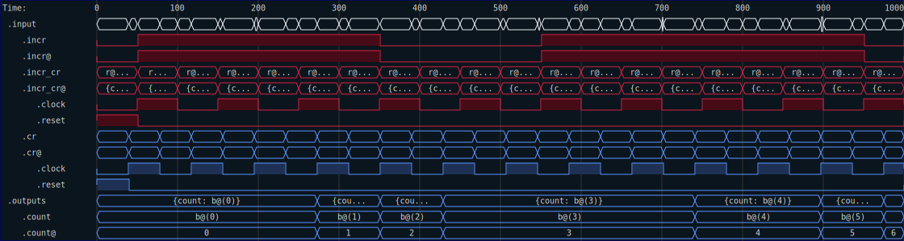

# Tracing

One additional feature of `Timed` signals is that the timing domain of the signals is recorded in any trace file that is generated.  This feature allows you to see (at a glance) which signals belong to with clock domain, even if the clocks are hidden.  That can help with debugging and finding issues with glitches or other timing related problems.  

To demonstrate this feature, you need a VCD viewer that is capable of reading the type information present in the VCD to extract the needed clock domain color for each signal.  But the `SVG` generation built into RHDL can also do this.  To see how, consider the following test of a clock domain crossing counter:


```rust
{{#rustdoc_include ../code/src/timed/tracing.rs:time_tracing_waveform}}
```

Running this test generates the following SVG



Note that the signals are colored to match the time domain they belong to.  In this case, the input count signal is `incr` and is synchronized to the `Red` clock domain, while the output `count` is synchronized to the `Blue` clock domain.  The circuit accepts both the `Red` and `Blue` clocks as inputs. 
