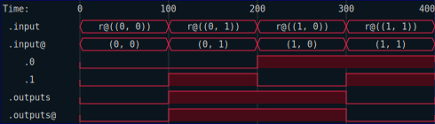
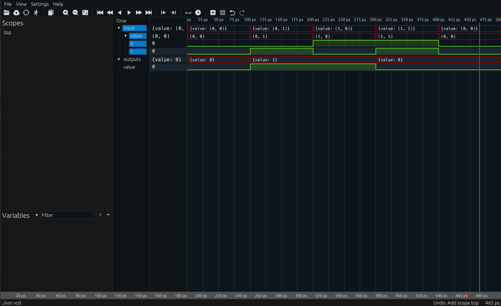

## Making Trace Files

There are other things you can do with an output iterator from the `.run` method.  One neat thing you can do in RHDL is to generate a VCD file or even a SVG of a trace display.  The `Vcd` container can collect the output of the simulation, and then be written to either type of file.  Using the `Vcd` container is extremely simple, you just `.collect` the iterator into it.  Consult the documentation to see what options the `svg` export supports.  You can filter traces, and adjust the sizes of various elements in the rendered image.

Here is the updated test

```rust
{{#rustdoc_include ../code/src/xor.rs:xor-step-14}}
```

The resulting SVG shows the input and output signals as one would expect for a trace file.



You can also generate a traditional `VCD` file which can be opened by other tools like [surfer](https://surfer-project.org/).  Here is a test file to generate a `.vcd` file.

```rust
{{#rustdoc_include ../code/src/xor.rs:xor-step-15}}
```

Here is a screen shot of the VCD as rendered by `surfer`:



The red traces in both cases are not merely stylistic choices, they indicate that these signals are in the `Red` domain.  When you have multiple timing domains active in your design at once, it can be helpful to tell from the color coding which signals belong to which domain.  We will come across an example later.


```admonish note
Ideally, you will want to install the `rhdl-surfer-plugin` to get type information when using `surfer` to view waveforms.  In that case, the plugin looks for a file with the same name as the VCD file, but with a `.rhdl` extension tacked on.  So for example, if you have a `xor.vcd` file, you would want a `xor.vcd.rhdl` file in the same directory.  The VCD writer built into RHDL automatically generates this file when you write out a VCD file.  It contains a serialized description of the type dictionary needed to decode RHDL signals in the waveform viewer.
```